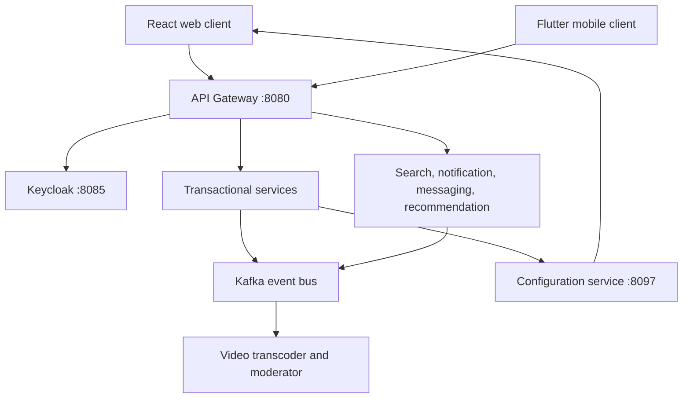
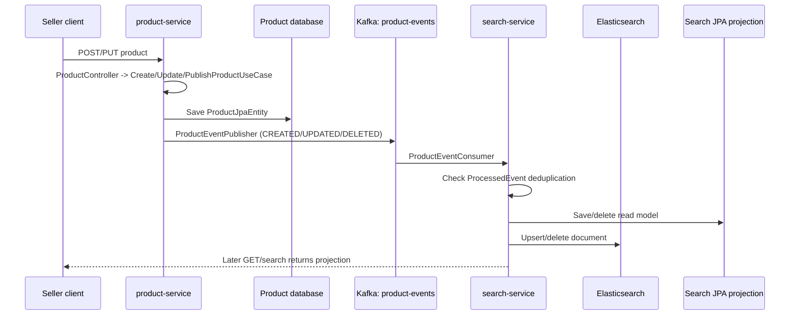
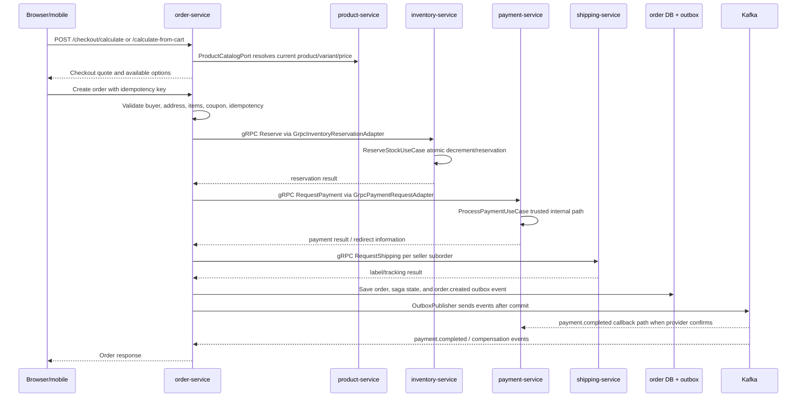
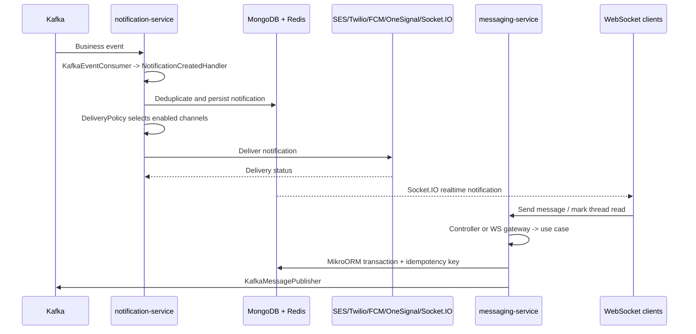
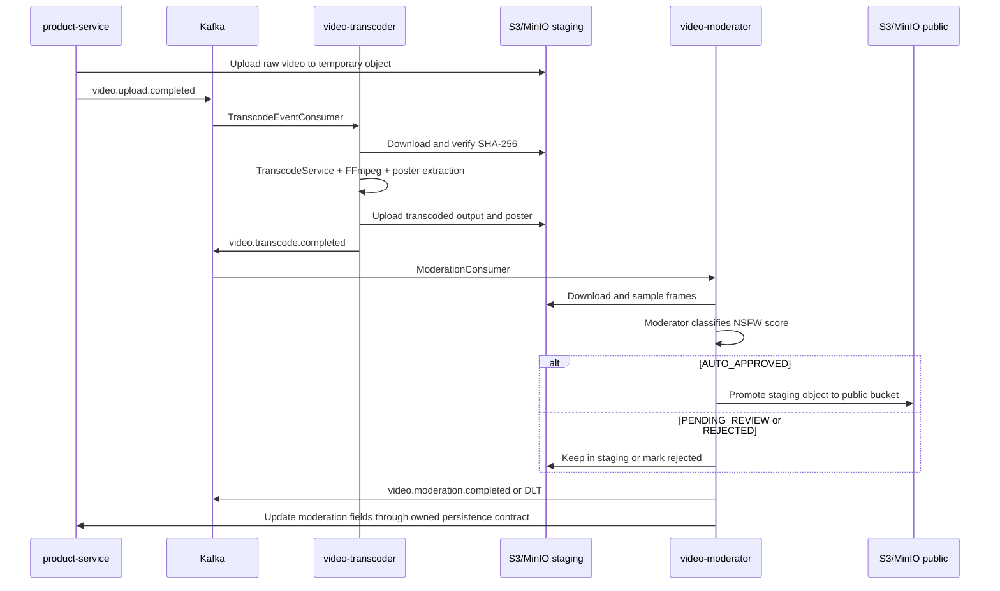
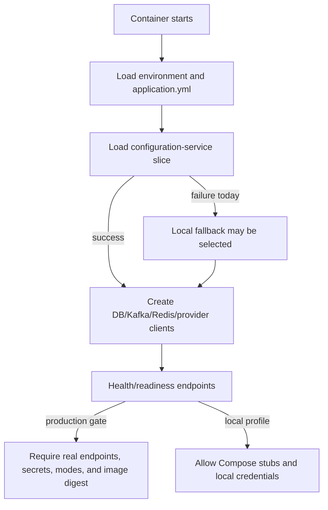

# VNShop Architecture and Service Guide

> Status snapshot: 2026-07-22. This document describes the repository as it exists at `main`.
> It is an engineering reference, not a production-readiness approval. The readiness review is
> recorded in [`docs/PRODUCTION-READINESS-REVIEW.md`](docs/PRODUCTION-READINESS-REVIEW.md).

## 1. System Boundary

VNShop is a Vietnamese multi-seller marketplace. The repository contains:

- 19 backend services across Spring Boot, NestJS, and Python.
- A React 18/Vite web client and a Flutter mobile client.
- PostgreSQL, Redis, Kafka, Elasticsearch, MongoDB, MinIO/S3, TimescaleDB, Keycloak, and observability tooling.
- Docker Compose for local integration and Kubernetes/Argo CD manifests for staging and production promotion.

The public request boundary is the API Gateway on port `8080`. Clients should not call the internal
service ports directly. Service-to-service calls use internal DNS, REST, gRPC, or Kafka depending on
the consistency requirement.

## 2. Runtime Topology



### Environments

| Environment | Source of runtime values | Intended use | Important constraint |
| --- | --- | --- | --- |
| Local Compose | `.env`, Compose environment, local volumes | Developer integration and E2E | Local credentials and stubs are expected. |
| Local staging-like Compose | `infra/compose/staging/docker-compose.staging.yml` | Manual integration rehearsal | It is explicitly local and must not be treated as production. |
| Kubernetes staging | `infra/k8s/overlays/staging` plus cluster secrets | Shared staging | Must use real image digests and non-local provider policy. |
| Kubernetes production | `infra/k8s/overlays/prod` plus secret manager/Sealed Secrets | Production promotion | The current manifest still contains placeholder digests and an empty SealedSecret; see the review ledger. |

### Deployment flow

1. CI builds and scans service images.
2. Images are published to GHCR.
3. The deployment repository/manifests pin images by digest.
4. Argo CD reconciles the selected overlay.
5. Kubernetes injects non-secret configuration from the overlay ConfigMap and credentials from `vnshop-runtime-secrets`.
6. Readiness probes gate traffic while liveness probes restart unhealthy workloads.

The repository currently has the deployment shape, but promotion is not production-ready until the
image digests, sealed secrets, provider modes, and external endpoints are supplied for the target
environment.

## 3. Service Catalog

### 3.1 Edge and identity

#### `api-gateway` - port 8080

- **Role:** Single public HTTP/WebSocket entry point.
- **Owns:** Route mapping, JWT resource-server validation, CORS, rate limiting, circuit breakers, security headers, correlation IDs, and the common API error envelope.
- **Dependencies:** Redis for rate-limit state, Keycloak issuer/JWK endpoints, and internal service DNS.
- **Boundary:** It is an adapter and policy layer. Domain rules belong in downstream services.
- **Readiness:** Core edge path is implemented. Production requires environment-provided issuer, Redis, CORS origins, TLS termination, and route targets; the local `application.yml` defaults to localhost when those values are absent.

#### `user-service` - port 8081

- **Role:** Buyer and seller identity data inside the marketplace bounded context.
- **Owns:** Registration, auth session/refresh flow, buyer profiles, seller profiles and approval, addresses, wishlist, public seller discovery, and GDPR export/delete use cases.
- **Dependencies:** PostgreSQL schema `user_svc`, Redis, Kafka, Keycloak admin/public endpoints, product-service seller statistics, and object storage for user media.
- **Boundary:** Native user data and marketplace profile policy stay here; Keycloak remains the identity provider.
- **Readiness:** Good domain/application separation and focused tests are present. Production still depends on non-local Keycloak URLs, database credentials, Kafka credentials, object storage, and callback origins.

### 3.2 Catalog and discovery

#### `product-service` - port 8082

- **Role:** Seller catalog and buyer-facing product context.
- **Owns:** Products, variants, categories, product eligibility/publication, images, reviews, questions, and seller product counts.
- **Dependencies:** PostgreSQL schema `product_svc`, Redis, Kafka, and S3-compatible object storage.
- **Events:** Publishes catalog/product changes for search and downstream projections.
- **Readiness:** Uses application/domain/infrastructure separation and cursor-based catalog reads. Production requires real storage endpoints/credentials, Kafka ACLs, and a production moderation/storage policy.

#### `search-service` - port 8086

- **Role:** Search read model and faceted product discovery.
- **Owns:** Search projections, full-text queries, filters, facets, cursors, and search-specific eligibility.
- **Dependencies:** PostgreSQL schema `search_svc`, Elasticsearch, Kafka product events, Redis, and Keycloak for protected operations.
- **Boundary:** Search is a disposable/read-optimized projection; product-service remains the catalog source of truth.
- **Readiness:** Query and projection code is present. Production requires authenticated Elasticsearch, a reindex/bootstrap procedure, and external GeoIP data when location features are enabled.

#### `recommendations-service` - port 8094

- **Role:** Frequently-bought-together and related-product recommendations.
- **Owns:** Co-purchase aggregation, processed-order idempotency, product projections, and recommendation queries.
- **Dependencies:** PostgreSQL, Kafka order/product events, and product-service REST calls.
- **Readiness:** The event projection and idempotency boundaries exist. It is a best-effort read model and should degrade as an explicit empty recommendation result, not by silently switching to local demo data.

### 3.3 Cart and checkout

#### `cart-service` - port 8084

- **Role:** Authenticated cart persistence and guest-cart merge boundary.
- **Owns:** Cart items, quantities, item limits, expiry policy, product snapshots, add/update/remove/clear, and the authenticated merge use case.
- **Dependencies:** Redis as the hot cart store, PostgreSQL/MikroORM migration support where enabled, and product-service for current product validation.
- **Boundary:** Cart owns cart intent; product and inventory own availability and stock truth.
- **Readiness:** Domain tests cover quantity and merge behavior. Production requires Redis URL/auth configuration and one authoritative consent-gated merge path in the client/server contract.

#### `order-service` - port 8091

- **Role:** Commerce transaction and fulfillment orchestration.
- **Owns:** Checkout, orders, sub-orders, coupon ownership/redemption, return and dispute workflows, invoice requests, saga state, outbox records, and order/finance projections.
- **Dependencies:** PostgreSQL schema `order_svc`, Redis, Kafka, inventory/payment/shipping gRPC clients, product and coupon ports, and configuration-service.
- **Events:** Coordinates order, payment, inventory, shipping, return, refund, payout, and invoice events through outbox-backed transitions.
- **Boundary:** It owns order lifecycle state; it does not own payment ledger balances, stock, shipment state, or seller wallet balances.
- **Readiness:** It has the widest money-path surface and the strongest test coverage in the repository. Production requires durable outbox relay/claim monitoring, Kafka ACLs, gRPC target configuration, idempotency, and end-to-end compensation tests.

#### `coupon-service` - port 8088 (legacy)

- **Role:** Legacy coupon CRUD, validation, and usage tracking.
- **Owns:** Coupon terms, discount rules, activation/deactivation, and usage persistence in the older service boundary.
- **Dependencies:** PostgreSQL, Redis, Kafka, and Keycloak.
- **Boundary:** Current checkout ownership is moving toward order-service. This service must be treated as a compatibility/migration source until the deployment and API ownership decision is completed.
- **Readiness:** The code is testable, but its deployment status is ambiguous: it remains in the Compose service graph while project documentation calls it archived. Do not promote it without an explicit ownership decision.

### 3.4 Payment, shipping, and finance

#### `payment-service` - port 8092

- **Role:** Payment intent, provider callback, ledger, status, and refund boundary.
- **Owns:** Payment records, idempotency keys, provider adapters, COD/VietQR/SePay/Stripe/PayPal/VNPay/MoMo policy, IPN/webhook handling, FX conversion, and refund requests.
- **Dependencies:** PostgreSQL schema `payment_svc`, Kafka, provider APIs, configuration-service, and Keycloak.
- **Events:** Publishes payment completion, failure, refund-requested, and refunded events for the order saga.
- **Readiness:** COD/VietQR and provider adapters are represented, but the current repository explicitly exposes stub/demo/sandbox/disabled modes. FX conversion has a configured fallback rate, which must be changed to a fail-closed or approved stale-rate policy for real money flows.

#### `shipping-service` - port 8093

- **Role:** Carrier abstraction and shipment lifecycle.
- **Owns:** Carrier quotes, labels, tracking, shipment cancellation, GHN/GHTK adapters, webhook authentication, status mapping, and webhook outbox relay.
- **Dependencies:** PostgreSQL schema `shipping_svc`, Kafka, carrier APIs, and gRPC clients.
- **Events:** Publishes shipment created, updated, cancelled, and carrier status transitions.
- **Boundary:** Carrier-specific payloads stay in adapters; the domain exposes carrier-neutral shipment concepts.
- **Readiness:** Webhook acknowledgment now depends on durable outbox acceptance, but `CARRIER_MODE` defaults to `stub`, GHN defaults to a dev endpoint, and carrier credentials are optional. Production must inject live mode, live endpoints, credentials, callback security, and relay observability.

#### `seller-finance-service` - port 8090

- **Role:** Seller wallet and payout bounded context.
- **Owns:** Wallet credits/debits, commission calculation, commission tiers, payout requests/processing, transaction history, and refund debits.
- **Dependencies:** PostgreSQL schema `seller_finance_svc`, Redis, Kafka order/payment events, and Keycloak admin/seller roles.
- **Boundary:** It is the accounting projection for seller balances; payment-service owns external payment state.
- **Readiness:** Refund idempotency and commission propagation are implemented. Production needs reconciliation, payout provider integration/controls, audit retention, and a business-owned commission configuration.

#### `invoice-service` - port 8098

- **Role:** Vietnamese electronic invoice generation and submission boundary.
- **Owns:** Invoice aggregates, seller authorization, XML generation, invoice status, and GDT submission integration.
- **Dependencies:** PostgreSQL schema `invoice_svc`, Kafka order-confirmed events, configuration-service, Keycloak, and the external GDT API when enabled.
- **Readiness:** XML generation and ownership checks are present. The seller tax identity in the central config is a placeholder and must be replaced before any legal invoice flow is enabled.

### 3.5 Communication and notification

#### `notification-service` - port 8087

- **Role:** User notification delivery and inbox.
- **Owns:** Notification threads, per-channel preferences, unread/read state, delivery policy, retries, and in-app/WebSocket delivery.
- **Dependencies:** MongoDB, Redis, Kafka, SMTP/SES, SMS, FCM/OneSignal, and Keycloak.
- **Events:** Consumes order, payment, shipping, review, and account events and translates them into user notifications.
- **Readiness:** Domain-level channel filtering, deduplication, and retry use cases exist. Email/SMS providers are disabled by default and require real credentials, delivery limits, bounce handling, and operational dashboards.

#### `messaging-service` - port 8095

- **Role:** Buyer-seller direct messaging.
- **Owns:** Threads, messages, read state, idempotency, REST APIs, and WebSocket fan-out.
- **Dependencies:** PostgreSQL/MikroORM, Redis/socket state, Kafka event integration, and JWT validation.
- **Readiness:** The module has domain/application/infrastructure separation and WebSocket tests. Production requires connection limits, abuse/rate controls, retention policy, and external client origin configuration.

#### `monitoring-service-v2` - port 8096

- **Role:** Application health, metrics, service discovery, OpenAPI aggregation, and monitoring WebSocket surface.
- **Owns:** Health checks, metric persistence, alert entities, service discovery metadata, OpenAPI aggregation, and dashboard endpoints.
- **Dependencies:** TimescaleDB/PostgreSQL, Prometheus, gateway/service health endpoints, Redis where configured, and Keycloak roles.
- **Readiness:** It is an operations service, not a business source of truth. Production requires secure scrape endpoints, alert routing, retention sizing, and a clear distinction between platform health and business health.

### 3.6 Media pipeline

#### `video-transcoder` - worker

- **Role:** Asynchronous video processing.
- **Owns:** Transcode jobs/results, FFmpeg command construction, input/output object storage, and completion events.
- **Dependencies:** Kafka, S3-compatible object storage, FFmpeg, and a worker filesystem (tmpfs is required for staging files).
- **Readiness:** Command construction and checksum tests exist. Production requires resource quotas, media limits, malware/content controls, tmpfs enforcement, and durable retry/dead-letter handling.

#### `video-moderator` - worker

- **Role:** Asynchronous ML content classification and moderation decisions.
- **Owns:** Moderation consumption, model invocation/classification, result publication, and moderation artifacts.
- **Dependencies:** Kafka, object storage, Python ML/runtime dependencies, and its worker database/configuration where enabled.
- **Readiness:** The worker is deployable in the topology, but model versioning, confidence thresholds, human review, and failed-job replay must be operationalized before relying on it for enforcement.

## 4. Cross-Service Contracts

### Kafka

Kafka is the asynchronous integration boundary. The repository uses SASL authentication and per-service
ACLs in the main stack. Important event families include:

| Family | Producers | Consumers / projections |
| --- | --- | --- |
| `order.*` | order-service | finance, recommendations, notification, invoice |
| `payment.*` | payment-service | order-service, finance, notification |
| `inventory.*` | inventory-service | order-service, notification |
| `shipping.*` | shipping-service | order-service, notification |
| `product.*` | product-service | search, recommendations, notification |
| `return.*` | order-service | payment, finance, notification |
| `video.*` | video workers/product | product and moderation workflows |

Money-path events use outbox persistence and idempotent consumers. A producer acknowledgment, outbox
claim timeout, retry policy, and dead-letter policy are part of the contract, not incidental implementation
details.

### gRPC

The generated contracts in [`proto/`](proto/) cover:

- Inventory reserve/release.
- Payment request/status.
- Shipping request/label response.

The order service is the main synchronous orchestrator. Production deployments must inject the gRPC
hostnames and ports; local defaults use `localhost` for developer convenience.

### Storage ownership

Each transactional bounded context owns its schema and migrations. Redis is used for carts, caches,
rate limiting, deduplication, and transient connection state. Elasticsearch and recommendation/search
tables are projections, not authoritative product/order stores. MinIO is the local S3-compatible backend;
production must use the configured R2/S3-compatible endpoint and credentials.

## 5. Configuration Ownership

Configuration has three layers:

1. **Environment/runtime configuration:** endpoints, credentials, security modes, feature gates, and deployment identity.
2. **Configuration service:** business configuration in [`services/configuration-service/config/services.yml`](services/configuration-service/config/services.yml), exposed through authenticated service endpoints and a public client-safe projection.
3. **Service-local application files:** binding defaults and local developer fallbacks.

The third layer must never silently decide a production dependency. Current code still contains local
defaults in Java `application.yml` files, the web API endpoint module, and the mobile environment loader.
The complete evidence and remediation order are in the production-readiness review.

## 6. Security and Operations Baseline

- Keycloak is the identity provider; access tokens are validated at the gateway and service boundaries.
- Browser refresh tokens use an httpOnly cookie flow; the frontend should keep access tokens out of persistent storage.
- Kafka uses SASL and per-service credentials in the main deployment path.
- Kubernetes workloads run as non-root with restricted capabilities and read-only filesystems where configured.
- Health probes, Prometheus metrics, traces, logs, backups, and alert rules are present in `infra/`.
- Secrets must be supplied through a platform secret manager or Sealed Secrets. `.env`, `.env.secrets`, rendered Kafka JAAS files, and private keys are ignored and must never be committed.

The baseline is not equivalent to a production approval. An empty sealed-secret payload, placeholder
image digests, non-live provider modes, and missing external credentials are release blockers.

## 7. Delivery Gates

Run focused tests for the changed service, then the repository gates:

```bash
node infra/scripts/e2e-day.mjs
cd fe && npx playwright test
```

Additional gates include Java Maven tests/JaCoCo, NestJS Jest tests, Flutter tests, protobuf/Buf checks,
OpenAPI validation, dependency scanning, container scanning, and Kubernetes manifest rendering.

Before a production promotion, require all of the following:

- Real image digests exist and are pullable.
- Sealed Secrets contain encrypted values for every referenced runtime key.
- Public origins, OAuth callbacks, Kafka/DB/Redis/Elasticsearch endpoints, and storage URLs are real for the target environment.
- Carrier and payment modes are explicitly selected; no `stub`, `demo`, or unapproved `sandbox` provider is enabled.
- FX fallback behavior is approved for money paths.
- Invoice seller identity is real and legally approved.
- Backup restore and dead-letter replay have been exercised.
- Provider webhooks and Kafka/outbox failure paths have security-enabled integration coverage.

## 8. Change Guide

When changing a service boundary:

1. Update the service section in this file and the service inventory in `README.md`.
2. Update the relevant `.agents/AGENTS.md` or service handover.
3. Change the domain/application contract before adapters.
4. Add focused unit, integration, and contract tests.
5. Update Compose, Kubernetes, secrets, and CI references together.
6. Run the affected service tests and both end-to-end gates.
7. Record any deferred production work in [`docs/PRODUCTION-READINESS-REVIEW.md`](docs/PRODUCTION-READINESS-REVIEW.md).

## 9. Code-Level Structure

This section is the source-navigation map. The service catalog above describes ownership; this
section describes the classes that execute each boundary.

### 9.1 Layer contract

The Java services use a ports-and-adapters shape. The NestJS services use the same dependency
direction with TypeScript folders instead of Java packages.

```text
infrastructure/web, infrastructure/grpc, infrastructure/event
        | translates HTTP, gRPC, Kafka, or provider payloads
        v
application use cases and commands
        | coordinates a business operation through ports
        v
domain model and domain ports
        ^
        | implemented by
infrastructure/persistence, infrastructure/gateway, infrastructure/config
```

The dependency rule is one-way:

| Layer | May depend on | Must not depend on |
| --- | --- | --- |
| `domain` | JDK types, domain value objects, domain ports | Spring, Kafka, HTTP clients, JPA entities, controllers |
| `application` | domain types and ports | concrete infrastructure adapters |
| `infrastructure` | application and domain contracts, framework libraries | leaking provider DTOs into domain APIs |
| `web` / `grpc` | application use cases and transport DTOs | direct repository or provider calls |

Architecture tests enforce this rule in services such as [`order-service ArchitectureRulesTest`](services/order-service/src/test/java/com/vnshop/orderservice/ArchitectureRulesTest.java), [`product-service ArchitectureRulesTest`](services/product-service/src/test/java/com/vnshop/productservice/ArchitectureRulesTest.java), and [`coupon-service ArchitectureRulesTest`](services/coupon-service/src/test/java/com/vnshop/couponservice/ArchitectureRulesTest.java).

### 9.2 Canonical request path

For a normal authenticated request, the concrete call shape is:

```text
Client
  -> api-gateway RouteConfig / SecurityConfig / filters
  -> service infrastructure/web controller
  -> application/*UseCase.execute(...)
  -> domain validation and domain ports
  -> infrastructure adapter
  -> service-owned database or remote dependency
  -> response DTO
```

For an event, the shape is:

```text
transactional use case
  -> domain event or outbox port
  -> service-owned outbox table (same transaction where required)
  -> scheduled relay / Kafka producer
  -> consumer with deduplication
  -> application handler
  -> projection, state transition, or another outbox row
```

The outbox boundary matters: Kafka is not the source of truth for an order, payment, or accepted
carrier callback. The owning database is the source of truth; Kafka is the delivery mechanism.

## 10. Service Code Map

The following map names the most important executable code, not every DTO or test. Open the linked
class first when changing a service boundary.

| Service | Inbound adapters and application entrypoints | Domain, ports, adapters, and persistence |
| --- | --- | --- |
| **API Gateway** | [`RouteConfig`](services/api-gateway/src/main/java/com/vnshop/apigateway/infrastructure/route/RouteConfig.java), [`SecurityConfig`](services/api-gateway/src/main/java/com/vnshop/apigateway/infrastructure/config/SecurityConfig.java), [`CorrelationIdFilter`](services/api-gateway/src/main/java/com/vnshop/apigateway/infrastructure/filter/CorrelationIdFilter.java), [`UserIdHeaderFilter`](services/api-gateway/src/main/java/com/vnshop/apigateway/infrastructure/filter/UserIdHeaderFilter.java) | [`TieredRateLimiter`](services/api-gateway/src/main/java/com/vnshop/apigateway/infrastructure/config/TieredRateLimiter.java), [`ResilienceConfig`](services/api-gateway/src/main/java/com/vnshop/apigateway/infrastructure/config/ResilienceConfig.java), [`FallbackController`](services/api-gateway/src/main/java/com/vnshop/apigateway/infrastructure/web/FallbackController.java). It is a transport boundary, not a business-data owner. |
| **User** | [`AuthSessionController`](services/user-service/src/main/java/com/vnshop/userservice/infrastructure/web/AuthSessionController.java), [`UserController`](services/user-service/src/main/java/com/vnshop/userservice/infrastructure/web/UserController.java), [`SellerController`](services/user-service/src/main/java/com/vnshop/userservice/infrastructure/web/SellerController.java), [`AuthSessionUseCase`](services/user-service/src/main/java/com/vnshop/userservice/application/AuthSessionUseCase.java), registration and seller approval use cases | Domain profiles and addresses live under [`domain`](services/user-service/src/main/java/com/vnshop/userservice/domain). [`KeycloakTokenClient`](services/user-service/src/main/java/com/vnshop/userservice/infrastructure/keycloak/KeycloakTokenClient.java) owns token exchange; [`UserJpaRepository`](services/user-service/src/main/java/com/vnshop/userservice/infrastructure/persistence/UserJpaRepository.java) and the object-storage adapter persist user data and avatars. |
| **Product** | [`ProductController`](services/product-service/src/main/java/com/vnshop/productservice/infrastructure/web/ProductController.java), [`CreateProductUseCase`](services/product-service/src/main/java/com/vnshop/productservice/application/CreateProductUseCase.java), [`UpdateProductUseCase`](services/product-service/src/main/java/com/vnshop/productservice/application/UpdateProductUseCase.java), [`PublishProductUseCase`](services/product-service/src/main/java/com/vnshop/productservice/application/PublishProductUseCase.java) | Product and review models are under [`domain`](services/product-service/src/main/java/com/vnshop/productservice/domain). [`ProductEventPublisher`](services/product-service/src/main/java/com/vnshop/productservice/infrastructure/event/ProductEventPublisher.java) and [`VideoEventPublisher`](services/product-service/src/main/java/com/vnshop/productservice/infrastructure/event/VideoEventPublisher.java) publish lifecycle events; [`ProductJpaEntity`](services/product-service/src/main/java/com/vnshop/productservice/infrastructure/persistence/ProductJpaEntity.java) owns the write model. |
| **Search** | [`SearchProductsUseCase`](services/search-service/src/main/java/com/vnshop/searchservice/application/SearchProductsUseCase.java) handles page search, cursor search, facets, categories, and suggestions | [`ProductEventConsumer`](services/search-service/src/main/java/com/vnshop/searchservice/infrastructure/kafka/ProductEventConsumer.java) is an idempotent projection consumer. [`ElasticsearchSearchAdapter`](services/search-service/src/main/java/com/vnshop/searchservice/infrastructure/elasticsearch/ElasticsearchSearchAdapter.java) is the primary read adapter and [`JpaSearchAdapter`](services/search-service/src/main/java/com/vnshop/searchservice/infrastructure/persistence/JpaSearchAdapter.java) is the current fallback. [`SearchCursorCodec`](services/search-service/src/main/java/com/vnshop/searchservice/application/SearchCursorCodec.java) signs cursor state. |
| **Cart** | [`CartController`](services/cart-service/src/cart/infrastructure/cart.controller.ts), [`AddToCartUseCase`](services/cart-service/src/cart/application/add-to-cart.use-case.ts), [`UpdateCartItemUseCase`](services/cart-service/src/cart/application/update-cart-item.use-case.ts), [`ViewCartUseCase`](services/cart-service/src/cart/application/view-cart.use-case.ts) | [`Cart`](services/cart-service/src/cart/domain/cart.ts) and [`CartItem`](services/cart-service/src/cart/domain/cart-item.ts) hold item-key and quantity rules. [`MergeCartUseCase`](services/cart-service/src/cart/application/merge-cart.use-case.ts) adds guest quantities to the authenticated cart and deletes the guest key after success. [`CartRedisRepository`](services/cart-service/src/cart/infrastructure/cart.redis-repository.ts) and [`CartPersistenceService`](services/cart-service/src/cart/infrastructure/cart-persistence.service.ts) own Redis persistence; [`merge-cart.use-case.spec.ts`](services/cart-service/src/cart/application/merge-cart.use-case.spec.ts) locks merge behavior. |
| **Order** | [`CheckoutController`](services/order-service/src/main/java/com/vnshop/orderservice/infrastructure/web/CheckoutController.java), [`OrderController`](services/order-service/src/main/java/com/vnshop/orderservice/infrastructure/web/OrderController.java), [`ReturnController`](services/order-service/src/main/java/com/vnshop/orderservice/infrastructure/web/ReturnController.java), [`AdminDisputeController`](services/order-service/src/main/java/com/vnshop/orderservice/infrastructure/web/AdminDisputeController.java) | [`CheckoutOrderUseCase`](services/order-service/src/main/java/com/vnshop/orderservice/application/CheckoutOrderUseCase.java) resolves prices from Product; [`CreateOrderUseCase`](services/order-service/src/main/java/com/vnshop/orderservice/application/CreateOrderUseCase.java) owns the transaction and saga start. Ports include inventory, payment, shipping, coupon, cart, refund, and outbox contracts. [`SagaOrchestrator`](services/order-service/src/main/java/com/vnshop/orderservice/application/saga/SagaOrchestrator.java), [`OutboxPortAdapter`](services/order-service/src/main/java/com/vnshop/orderservice/infrastructure/outbox/OutboxPortAdapter.java), [`OutboxPublisher`](services/order-service/src/main/java/com/vnshop/orderservice/infrastructure/outbox/OutboxPublisher.java), payment listeners, and gRPC adapters complete the workflow. |
| **Inventory** | [`GrpcInventoryServer`](services/inventory-service/src/main/java/com/vnshop/inventoryservice/infrastructure/grpc/GrpcInventoryServer.java), [`FlashSaleController`](services/inventory-service/src/main/java/com/vnshop/inventoryservice/infrastructure/flash/FlashSaleController.java), [`ReserveStockUseCase`](services/inventory-service/src/main/java/com/vnshop/inventoryservice/application/ReserveStockUseCase.java), [`ReleaseStockUseCase`](services/inventory-service/src/main/java/com/vnshop/inventoryservice/application/ReleaseStockUseCase.java) | [`StockReservation`](services/inventory-service/src/main/java/com/vnshop/inventoryservice/domain/StockReservation.java) is the reservation model. [`StockLevelJpaEntity`](services/inventory-service/src/main/java/com/vnshop/inventoryservice/infrastructure/persistence/StockLevelJpaEntity.java) and [`StockReservationJpaEntity`](services/inventory-service/src/main/java/com/vnshop/inventoryservice/infrastructure/persistence/StockReservationJpaEntity.java) persist stock; [`InventoryEventPublisher`](services/inventory-service/src/main/java/com/vnshop/inventoryservice/infrastructure/event/InventoryEventPublisher.java) emits reservation results and [`ReleaseRequestedKafkaConsumer`](services/inventory-service/src/main/java/com/vnshop/inventoryservice/infrastructure/event/ReleaseRequestedKafkaConsumer.java) handles the asynchronous release fallback. |
| **Coupon** | [`CouponController`](services/coupon-service/src/main/java/com/vnshop/couponservice/infrastructure/web/CouponController.java), [`ApplyCouponUseCase`](services/coupon-service/src/main/java/com/vnshop/couponservice/application/ApplyCouponUseCase.java), [`ValidateCouponUseCase`](services/coupon-service/src/main/java/com/vnshop/couponservice/application/ValidateCouponUseCase.java) | [`Coupon`](services/coupon-service/src/main/java/com/vnshop/couponservice/domain/Coupon.java) and [`CouponValidation`](services/coupon-service/src/main/java/com/vnshop/couponservice/domain/CouponValidation.java) enforce discount rules. [`CouponRepositoryAdapter`](services/coupon-service/src/main/java/com/vnshop/couponservice/infrastructure/persistence/CouponRepositoryAdapter.java) and [`CouponUsageAdapter`](services/coupon-service/src/main/java/com/vnshop/couponservice/infrastructure/persistence/CouponUsageAdapter.java) persist coupon state and usage. |
| **Payment** | [`PaymentController`](services/payment-service/src/main/java/com/vnshop/paymentservice/infrastructure/web/PaymentController.java), [`ProcessPaymentUseCase`](services/payment-service/src/main/java/com/vnshop/paymentservice/application/ProcessPaymentUseCase.java), [`RefundPaymentUseCase`](services/payment-service/src/main/java/com/vnshop/paymentservice/application/RefundPaymentUseCase.java), [`HandleVnpayIpnUseCase`](services/payment-service/src/main/java/com/vnshop/paymentservice/application/HandleVnpayIpnUseCase.java) | [`Payment`](services/payment-service/src/main/java/com/vnshop/paymentservice/domain/Payment.java), [`LedgerService`](services/payment-service/src/main/java/com/vnshop/paymentservice/application/ledger/LedgerService.java), [`CompositePaymentGateway`](services/payment-service/src/main/java/com/vnshop/paymentservice/infrastructure/gateway/CompositePaymentGateway.java), provider handlers, webhook controllers, and [`PaymentCallbackOutboxRelay`](services/payment-service/src/main/java/com/vnshop/paymentservice/infrastructure/event/PaymentCallbackOutboxRelay.java). Payment, idempotency, callback, ledger, and reconciliation entities are under [`infrastructure/persistence`](services/payment-service/src/main/java/com/vnshop/paymentservice/infrastructure/persistence). |
| **Shipping** | [`ShippingController`](services/shipping-service/src/main/java/com/vnshop/shippingservice/infrastructure/web/ShippingController.java), [`RateQuoteController`](services/shipping-service/src/main/java/com/vnshop/shippingservice/infrastructure/web/RateQuoteController.java), [`GhnWebhookController`](services/shipping-service/src/main/java/com/vnshop/shippingservice/infrastructure/web/GhnWebhookController.java), [`GhtkWebhookController`](services/shipping-service/src/main/java/com/vnshop/shippingservice/infrastructure/web/GhtkWebhookController.java), [`ReceiveCarrierWebhookUseCase`](services/shipping-service/src/main/java/com/vnshop/shippingservice/application/ReceiveCarrierWebhookUseCase.java) | [`CarrierGatewayPort`](services/shipping-service/src/main/java/com/vnshop/shippingservice/domain/port/out/CarrierGatewayPort.java) separates carrier behavior. [`GhnCarrierGateway`](services/shipping-service/src/main/java/com/vnshop/shippingservice/infrastructure/carrier/GhnCarrierGateway.java), [`GhtkCarrierGateway`](services/shipping-service/src/main/java/com/vnshop/shippingservice/infrastructure/carrier/GhtkCarrierGateway.java), and [`StubCarrierGateway`](services/shipping-service/src/main/java/com/vnshop/shippingservice/infrastructure/carrier/StubCarrierGateway.java) implement it. [`ShippingWebhookOutboxRelay`](services/shipping-service/src/main/java/com/vnshop/shippingservice/infrastructure/event/ShippingWebhookOutboxRelay.java) delivers accepted callbacks; [`ShippingEventPublisher`](services/shipping-service/src/main/java/com/vnshop/shippingservice/infrastructure/event/ShippingEventPublisher.java) publishes status events. |
| **Seller Finance** | [`SellerFinanceController`](services/seller-finance-service/src/main/java/com/vnshop/sellerfinanceservice/infrastructure/web/SellerFinanceController.java), [`AdminFinanceController`](services/seller-finance-service/src/main/java/com/vnshop/sellerfinanceservice/infrastructure/web/AdminFinanceController.java), wallet and payout use cases | [`SellerWallet`](services/seller-finance-service/src/main/java/com/vnshop/sellerfinanceservice/domain/SellerWallet.java) and [`Payout`](services/seller-finance-service/src/main/java/com/vnshop/sellerfinanceservice/domain/Payout.java) model balances and payout state. [`OrderCreatedFinanceListener`](services/seller-finance-service/src/main/java/com/vnshop/sellerfinanceservice/infrastructure/event/OrderCreatedFinanceListener.java) credits seller finance from order events; [`PaymentRefundedFinanceListener`](services/seller-finance-service/src/main/java/com/vnshop/sellerfinanceservice/infrastructure/event/PaymentRefundedFinanceListener.java) reverses funds. `ProcessedOrderEvent` and `ProcessedRefund` provide consumer deduplication. |
| **Invoice** | [`InvoiceController`](services/invoice-service/src/main/java/com/vnshop/invoiceservice/infrastructure/web/InvoiceController.java), [`InvoiceService`](services/invoice-service/src/main/java/com/vnshop/invoiceservice/application/InvoiceService.java), [`InvoiceSubmissionService`](services/invoice-service/src/main/java/com/vnshop/invoiceservice/application/gdt/InvoiceSubmissionService.java) | [`OrderConfirmedListener`](services/invoice-service/src/main/java/com/vnshop/invoiceservice/infrastructure/event/OrderConfirmedListener.java) creates an idempotent draft. [`InvoiceXmlGenerator`](services/invoice-service/src/main/java/com/vnshop/invoiceservice/application/xml/InvoiceXmlGenerator.java) creates and validates XML; [`GdtApiClient`](services/invoice-service/src/main/java/com/vnshop/invoiceservice/application/gdt/GdtApiClient.java) submits to the tax provider. Invoice repositories and migrations own the lifecycle. |
| **Notification** | [`NotificationController`](services/notification-service/src/notification/infrastructure/rest/notification.controller.ts), [`NotificationPreferencesController`](services/notification-service/src/notification/infrastructure/rest/notification-preferences.controller.ts), command/query use cases | [`KafkaEventConsumer`](services/notification-service/src/notification/infrastructure/messaging/kafka-event.consumer.ts) maps business events to [`NotificationCreatedHandler`](services/notification-service/src/notification/application/event-handler/notification-created.handler.ts). [`DeliveryPolicy`](services/notification-service/src/notification/domain/service/delivery-policy.ts) chooses channels; SES, Twilio, FCM, OneSignal, and Socket.IO adapters implement outbound ports. Mongo repositories persist notifications and Redis adapters provide deduplication and connection state. |
| **Messaging** | [`MessagingController`](services/messaging-service/src/messaging/infrastructure/messaging.controller.ts), [`MessagingWsGateway`](services/messaging-service/src/messaging/infrastructure/messaging-ws.gateway.ts), create/list/send/read use cases | [`Thread`](services/messaging-service/src/messaging/domain/thread.ts) and [`Message`](services/messaging-service/src/messaging/domain/message.ts) are the domain model. [`KafkaMessagePublisher`](services/messaging-service/src/messaging/application/kafka-message.publisher.ts) and [`KafkaMessageConsumer`](services/messaging-service/src/messaging/application/kafka-message.consumer.ts) distribute events; [`IdempotencyStore`](services/messaging-service/src/messaging/infrastructure/idempotency-store.ts) protects retries; MikroORM repositories persist threads and messages. |
| **Recommendations** | [`RecommendationsController`](services/recommendations-service/src/main/java/com/vnshop/recommendationsservice/infrastructure/web/RecommendationsController.java), [`YouMayAlsoLikeUseCase`](services/recommendations-service/src/main/java/com/vnshop/recommendationsservice/application/YouMayAlsoLikeUseCase.java), [`FrequentlyBoughtTogetherUseCase`](services/recommendations-service/src/main/java/com/vnshop/recommendationsservice/application/FrequentlyBoughtTogetherUseCase.java) | [`OrderEventListener`](services/recommendations-service/src/main/java/com/vnshop/recommendationsservice/infrastructure/event/OrderEventListener.java) builds co-purchase projections. [`RecommendationPersistenceAdapter`](services/recommendations-service/src/main/java/com/vnshop/recommendationsservice/infrastructure/persistence/RecommendationPersistenceAdapter.java) owns the projection; [`RestProductServiceAdapter`](services/recommendations-service/src/main/java/com/vnshop/recommendationsservice/infrastructure/product/RestProductServiceAdapter.java) enriches product data. |
| **Monitoring** | [`DiscoveryController`](services/monitoring-service-v2/src/discovery/discovery.controller.ts), [`HealthController`](services/monitoring-service-v2/src/health/health.controller.ts), [`ProbeController`](services/monitoring-service-v2/src/health/probe.controller.ts), [`MonitoringGateway`](services/monitoring-service-v2/src/gateway/monitoring.gateway.ts) | [`DiscoveryService`](services/monitoring-service-v2/src/discovery/discovery.service.ts) maintains the service registry; [`OpenApiFetcher`](services/monitoring-service-v2/src/discovery/openapi-fetcher.ts) and [`OpenApiAggregator`](services/monitoring-service-v2/src/discovery/openapi-aggregator.ts) create the API view. [`HealthService`](services/monitoring-service-v2/src/health/health.service.ts), [`HealthChecker`](services/monitoring-service-v2/src/health/health-checker.ts), and [`MetricsService`](services/monitoring-service-v2/src/metrics/metrics.service.ts) poll, store, and alert on health. |
| **Video Transcoder** | [`TranscodeEventConsumer`](services/video-transcoder/src/main/java/com/vnshop/transcoder/consumer/TranscodeEventConsumer.java) consumes completed-upload jobs | [`TranscodeService`](services/video-transcoder/src/main/java/com/vnshop/transcoder/service/TranscodeService.java) downloads from S3, verifies the SHA-256, runs [`FfmpegCommandBuilder`](services/video-transcoder/src/main/java/com/vnshop/transcoder/service/FfmpegCommandBuilder.java), uploads outputs, and deletes staging data. [`TranscodeEventProducer`](services/video-transcoder/src/main/java/com/vnshop/transcoder/producer/TranscodeEventProducer.java) emits completed or failed outcomes. |
| **Video Moderator** | [`main.py`](services/video-moderator/app/main.py) exposes health/readiness and starts [`ModerationConsumer`](services/video-moderator/app/consumer.py) | [`Moderator`](services/video-moderator/app/moderator.py) scores sampled frames; [`StorageClient`](services/video-moderator/app/storage.py) promotes approved objects from staging to public storage; [`ModerationProducer`](services/video-moderator/app/producer.py) emits verdicts and DLT messages; [`db.py`](services/video-moderator/app/db.py) updates the owned moderation fields. |
| **Configuration** | [`ConfigurationController`](services/configuration-service/src/configuration/configuration.controller.ts) exposes public, service, global, and admin reload endpoints | [`ConfigurationService`](services/configuration-service/src/configuration/configuration.service.ts) loads [`services.yml`](services/configuration-service/config/services.yml), validates public origins, and returns a client-safe provider/feature projection. Service clients such as [`payment ConfigServiceClient`](services/payment-service/src/main/java/com/vnshop/paymentservice/infrastructure/config/ConfigServiceClient.java) fetch their slice during startup. |

> The seller-finance row intentionally points at code that consumes `order.created` and
> `payment.refunded`; it does not own order or payment state. The configuration-service row is
> also intentionally explicit about startup loading: the current client can fall back to local
> `application.yml`, which is a documented production-readiness finding rather than an invisible
> guarantee.

## 11. End-to-End Workflows

The diagrams below show the actual repository path. A box is a service or external dependency; a
class name in parentheses is the code responsible for that step.

### 11.1 Browser request and authentication

```mermaid
sequenceDiagram
  participant B as Browser / Flutter
  participant G as api-gateway
  participant U as user-service
  participant K as Keycloak
  B->>G: POST /auth/login
  G->>U: Forward request + correlation id
  U->>K: AuthSessionUseCase -> KeycloakTokenClient.passwordGrant
  K-->>U: access token + refresh token
  U-->>B: access token in response; vnshop_rt httpOnly cookie
  B->>G: API request with in-memory access token
  G->>K: Validate JWT / route authorization
  G->>U: Forward request and x-user-id context
  U-->>B: DTO response
```

Code path:

1. [`AuthSessionController.login`](services/user-service/src/main/java/com/vnshop/userservice/infrastructure/web/AuthSessionController.java) calls [`AuthSessionUseCase.login`](services/user-service/src/main/java/com/vnshop/userservice/application/AuthSessionUseCase.java).
2. [`KeycloakTokenClient`](services/user-service/src/main/java/com/vnshop/userservice/infrastructure/keycloak/KeycloakTokenClient.java) performs the provider exchange.
3. The controller writes `vnshop_rt` as an httpOnly cookie and returns only the access token and expiry to the client.
4. Refresh reads and rotates the cookie; logout revokes best-effort and always clears cookies.
5. Gateway filters add correlation and user context before the routed service executes.

### 11.2 Product write to searchable catalog



Important consistency details:

- Product write state is authoritative in product-service; search is eventually consistent.
- The search consumer records a processed-event key so Kafka redelivery is safe.
- The JPA projection is saved before the Elasticsearch index operation. Elasticsearch failures are logged and the read path currently falls back to JPA through [`ElasticsearchSearchAdapter`](services/search-service/src/main/java/com/vnshop/searchservice/infrastructure/elasticsearch/ElasticsearchSearchAdapter.java).
- Cursor search is decoded and signed in [`SearchProductsUseCase`](services/search-service/src/main/java/com/vnshop/searchservice/application/SearchProductsUseCase.java); the cursor secret must be an environment secret in production.

### 11.3 Guest cart to authenticated cart

```mermaid
sequenceDiagram
  participant B as Browser
  participant L as localStorage guest cart
  participant C as cart-service
  participant R as Redis
  B->>L: Add guest item
  B->>C: Login completes
  B->>C: GET /cart
  C->>R: Load authenticated cart
  C-->>B: Server cart
  B->>B: use-cart.ts requestMerge opens consent dialog
  alt User chooses Merge
    B->>C: Add each guest item with guest quantity
    C->>R: Add existing item quantity + guest quantity
    C-->>B: Updated cart after each item
    B->>L: Delete guest cart only after all items succeed
  else User chooses Keep separate
    B->>B: Close dialog; local items remain local
  end
```

Code path:

1. [`use-cart.ts`](fe/src/app/hooks/use-cart.ts) hydrates guest items from `vnshop:guest-cart`.
2. Authentication only calls `requestMerge`; it does not merge automatically.
3. `executeMerge` is the consent boundary. `mergeApprovedRef` must be true before `mergeGuestItems` can call the API.
4. The web client sends the guest quantity as an additive delta. For example, server quantity `5` plus guest quantity `2` becomes `7`, subject to the server cap.
5. The backend equivalent is [`MergeCartUseCase`](services/cart-service/src/cart/application/merge-cart.use-case.ts), which uses the item key (`productId:variantId`), adds quantities, saves the user cart, and deletes the `guest:<session>` key.
6. A partial client failure preserves only failed guest items locally so the user can retry instead of losing intent.

The mobile client has an independent local cart implementation under
[`cart_repository_impl.dart`](vnshop_mobile/lib/features/cart/data/repositories/cart_repository_impl.dart).
It must remain contract-compatible with the server cart rules; it is not a replacement for the
server cart after authentication.

### 11.4 Checkout, payment, inventory, and shipping saga



The request path in code is:

1. [`CheckoutController`](services/order-service/src/main/java/com/vnshop/orderservice/infrastructure/web/CheckoutController.java) accepts only product identifiers, variant identifiers, and quantities for the quote. It does not trust a browser-supplied price.
2. [`CheckoutOrderUseCase`](services/order-service/src/main/java/com/vnshop/orderservice/application/CheckoutOrderUseCase.java) resolves product data through `ProductCatalogPort` and creates authoritative `OrderItem` snapshots.
3. [`CreateOrderUseCase`](services/order-service/src/main/java/com/vnshop/orderservice/application/CreateOrderUseCase.java) validates idempotency, buyer ownership, address, coupon, and item constraints inside the order transaction.
4. It splits lines by seller, calculates commission/tax, starts [`SagaOrchestrator`](services/order-service/src/main/java/com/vnshop/orderservice/application/saga/SagaOrchestrator.java), then invokes inventory, payment, and shipping ports.
5. Inventory uses the gRPC server and [`ReserveStockUseCase`](services/inventory-service/src/main/java/com/vnshop/inventoryservice/application/ReserveStockUseCase.java). A missing stock projection currently logs a warning and allows the reservation without decrement; this is a known readiness gap.
6. Payment uses the trusted internal `processInternal` path. The browser-facing payment path resolves the amount from order-service, checks buyer ownership, hashes the idempotency request, and records a ledger posting only after a completed payment.
7. Shipping is requested once per seller suborder through [`GrpcShippingRequestAdapter`](services/order-service/src/main/java/com/vnshop/orderservice/infrastructure/grpc/GrpcShippingRequestAdapter.java).
8. [`OutboxPortAdapter`](services/order-service/src/main/java/com/vnshop/orderservice/infrastructure/outbox/OutboxPortAdapter.java) persists events; [`OutboxPublisher`](services/order-service/src/main/java/com/vnshop/orderservice/infrastructure/outbox/OutboxPublisher.java) sends and marks them published.
9. If a downstream step fails, [`SagaOrchestrator.compensate`](services/order-service/src/main/java/com/vnshop/orderservice/application/saga/SagaOrchestrator.java) publishes the required refund and inventory-release commands. A timeout job finalizes stuck saga state.
10. [`PaymentCompletedListener`](services/order-service/src/main/java/com/vnshop/orderservice/infrastructure/event/payment/PaymentCompletedListener.java) and [`SagaCompensationListener`](services/order-service/src/main/java/com/vnshop/orderservice/infrastructure/event/saga/SagaCompensationListener.java) are idempotent event boundaries.

### 11.5 Payment provider callback and completion event

```mermaid
sequenceDiagram
  participant Provider as Payment provider
  participant W as Payment webhook/controller
  participant U as Payment promotion/use case
  participant DB as payment DB
  participant O as payment callback outbox
  participant K as Kafka
  participant Order as order-service
  Provider->>W: IPN/webhook/return callback
  W->>W: Verify provider signature and idempotency
  W->>U: Promote or reconcile payment state
  U->>DB: Update payment and ledger in transaction
  U->>O: Insert payment.completed outbox row
  O->>K: PaymentCallbackOutboxRelay publishes after commit
  K->>Order: PaymentCompletedListener
  Order->>Order: Mark paid once; write order-paid event
```

Provider adapters are selected by [`CompositePaymentGateway`](services/payment-service/src/main/java/com/vnshop/paymentservice/infrastructure/gateway/CompositePaymentGateway.java).
The callback path must not use a browser return URL as proof of payment; provider-signed server
callbacks and reconciliation are the authoritative paths. The current provider matrix and known
stub/demo modes are recorded in the [production-readiness review](docs/PRODUCTION-READINESS-REVIEW.md).

### 11.6 Carrier label and webhook delivery

```mermaid
sequenceDiagram
  participant C as Carrier GHN/GHTK
  participant G as api-gateway
  participant W as Shipping webhook controller
  participant V as Signature service + mapper
  participant A as ReceiveCarrierWebhookUseCase
  participant DB as Shipping webhook outbox
  participant R as ShippingWebhookOutboxRelay
  participant K as Kafka
  participant O as order-service
  C->>G: POST /webhooks/ghn or /webhooks/ghtk
  G->>W: Public callback route
  W->>V: Validate signature/token; map provider payload
  W->>A: receive(CarrierWebhookEvent)
  A->>DB: Durable accept with duplicate identity check
  DB-->>W: ACCEPTED or DUPLICATE
  W-->>C: 200 only after durable accept; 503 on storage failure
  R->>DB: Claim pending rows and recover stale claims
  R->>K: ShippingEventPublisher -> shipping.status.updated
  K->>O: Consume status transition
  R->>DB: Mark published or retry/dead with exponential backoff
```

Code path:

1. Gateway [`SecurityConfig`](services/api-gateway/src/main/java/com/vnshop/apigateway/infrastructure/config/SecurityConfig.java) permits the two public callback paths so a carrier does not need a user JWT. This permit must be paired with provider signature validation.
2. [`GhnWebhookController`](services/shipping-service/src/main/java/com/vnshop/shippingservice/infrastructure/web/GhnWebhookController.java) and [`GhtkWebhookController`](services/shipping-service/src/main/java/com/vnshop/shippingservice/infrastructure/web/GhtkWebhookController.java) validate required identifiers, call the carrier-specific signature service, map payloads, and call the shared use case.
3. [`ReceiveCarrierWebhookUseCase`](services/shipping-service/src/main/java/com/vnshop/shippingservice/application/ReceiveCarrierWebhookUseCase.java) treats the outbox insert as the HTTP acknowledgement boundary.
4. [`ShippingWebhookOutboxRelay`](services/shipping-service/src/main/java/com/vnshop/shippingservice/infrastructure/event/ShippingWebhookOutboxRelay.java) claims pending records, publishes to Kafka, records attempts, schedules exponential retry, and moves exhausted records to failed state.
5. The current implementation still has a separate publisher-level acknowledgment risk documented as PR-000/PR-005 in the review. Keep the HTTP durability contract and Kafka acknowledgment contract distinct when changing this path.

### 11.7 Notification and messaging fan-out



Notification delivery is a fan-out concern and must not become part of the checkout transaction.
Messaging owns threads/messages and uses an idempotency store so WebSocket retries or duplicate
HTTP submissions do not create duplicate messages.

### 11.8 Video upload, transcode, and moderation



The transcoder uses local disk only as bounded FFmpeg staging; object storage remains the durable
media source. The moderator owns the verdict and emits a result for product-service/admin review.

## 12. State Machines and Delivery Semantics

### 12.1 Order saga

```text
STARTED
  -> INVENTORY_RESERVED
  -> PAYMENT_CHARGED
  -> SHIPPING_CREATED
  -> COMPLETED

Any step failure:
  INVENTORY failure -> FAILED
  PAYMENT failure   -> release inventory -> FAILED
  SHIPPING failure  -> refund payment + release inventory -> FAILED
  timeout           -> COMPENSATING or FAILED according to last completed step
```

[`SagaOrchestrator`](services/order-service/src/main/java/com/vnshop/orderservice/application/saga/SagaOrchestrator.java)
stores saga state, writes compensation events through an outbox port, and finalizes only after
compensation confirmation. Do not add a direct cross-service database update to this flow.

### 12.2 Outbox rows

| State | Meaning | Owner action |
| --- | --- | --- |
| `PENDING` | Durable event has not been sent | Claim and publish |
| `PROCESSING` / claimed | A worker owns the delivery attempt | Recover after claim timeout |
| `PUBLISHED` | Kafka producer acknowledged the send | Retain for audit/retention policy |
| `FAILED` / dead | Retry budget exhausted | Alert, inspect, and replay deliberately |

Order outbox schema is [`V2__outbox_schema.sql`](services/order-service/src/main/resources/db/migration/V2__outbox_schema.sql).
Saga state schema is [`V9__saga_schema.sql`](services/order-service/src/main/resources/db/migration/V9__saga_schema.sql).
Shipping webhook outbox behavior is implemented in [`ShippingWebhookOutboxRelay`](services/shipping-service/src/main/java/com/vnshop/shippingservice/infrastructure/event/ShippingWebhookOutboxRelay.java).

### 12.3 Payment and provider states

```text
PENDING -> COMPLETED -> REFUNDED
       \-> FAILED

Provider callback:
  received -> signature verified -> idempotency checked -> promoted -> payment.completed outbox
                                               \-> dead-letter / reconciliation issue
```

`ProcessPaymentUseCase` deliberately performs the provider side effect outside the database
transaction, then persists the result and ledger entry in a transaction. If persistence fails after
a provider charge, reconciliation must recover the orphan; a database rollback cannot reverse an
external bank charge.

### 12.4 Search and media states

| Projection/work item | States and transition |
| --- | --- |
| Search product projection | Product event -> dedup check -> JPA read model -> Elasticsearch upsert/delete; ES failure leaves JPA available and is observable. |
| Transcoding | `video.upload.completed` -> download/hash verification -> FFmpeg -> output upload -> `video.transcode.completed`; retryable errors go through Kafka retry/DLT. |
| Moderation | Transcode completed -> frame analysis -> `AUTO_APPROVED`, `PENDING_REVIEW`, or `REJECTED`; approved objects are promoted to the public bucket. |
| Invoice | `DRAFT` -> validated XML -> submitted to GDT -> accepted/rejected; rejected invoices can be corrected and resubmitted by an admin. |

## 13. Current Local Fallbacks and Their Production Meaning

These are documented intentionally so a future engineer can distinguish a design fallback from an
accidental hardcoded dependency.

| Location | Current behavior | Why it exists locally | Production requirement |
| --- | --- | --- | --- |
| [`ConfigServiceClient`](services/payment-service/src/main/java/com/vnshop/paymentservice/infrastructure/config/ConfigServiceClient.java) and equivalent clients | Startup fetch failure logs a warning and uses local `application.yml`; loading occurs in `ApplicationRunner` | Lets one service run while configuration-service is absent | Fail readiness or require a signed/versioned config snapshot; do not silently choose payment/shipping modes. |
| [`services.yml`](services/configuration-service/config/services.yml) | Shipping is `stub`; COD/VietQR are marked enabled with stub/demo semantics; invoice seller identity is a placeholder | Local/demo integration | Replace with environment-owned values and reject placeholder identity in production. |
| [`StubCarrierGateway`](services/shipping-service/src/main/java/com/vnshop/shippingservice/infrastructure/carrier/StubCarrierGateway.java) | Generates local shipping behavior when `CARRIER_MODE=stub` | Compose and tests | `CARRIER_MODE=live`, real GHN/GHTK URLs, credentials, webhook secrets, and provider contract tests. |
| [`ElasticsearchSearchAdapter`](services/search-service/src/main/java/com/vnshop/searchservice/infrastructure/elasticsearch/ElasticsearchSearchAdapter.java) | Falls back to JPA search on empty results or Elasticsearch errors | Keeps catalog browseable when the search projection is unavailable | Alert on fallback rate; decide whether stale JPA reads are acceptable for each endpoint. |
| [`ReserveStockUseCase`](services/inventory-service/src/main/java/com/vnshop/inventoryservice/application/ReserveStockUseCase.java) | Allows a reservation when no projected stock row exists, with a warning | Prevents new local products from being unpurchasable before projection catches up | Build the product-to-inventory projection or fail closed for real inventory. |
| [`AuthSessionController`](services/user-service/src/main/java/com/vnshop/userservice/infrastructure/web/AuthSessionController.java) | Has localhost defaults for callback, Keycloak, and frontend URLs | Developer login without a full environment file | Require production URLs from environment/config service and reject localhost at readiness. |
| Web [`use-cart.ts`](fe/src/app/hooks/use-cart.ts) and mobile cart repository | Guest cart is local until authentication and explicit merge consent | Guests need a cart before an account exists and offline/mobile UI needs continuity | Treat local storage as a temporary intent buffer only; authenticated checkout must use server cart. |
| Product recently viewed UI | Recent products are localStorage-only | Fast client-only personalization | Move to an authenticated profile/event store if cross-device history is a product requirement. |
| FX adapter/config | Fixed or local fallback rates may be used when the live FX dependency is unavailable | Deterministic local tests and non-money-path development | Money paths require a fresh approved rate, provenance, timestamp, and alert when stale. |
| Video transcode/moderation | Local filesystem is used for bounded process staging | FFmpeg requires local files | Keep only transient files locally; use S3-compatible storage for every durable input/output and configure tmpfs in deployments. |

The full finding list, severity, evidence, and closure order remain in
[`docs/PRODUCTION-READINESS-REVIEW.md`](docs/PRODUCTION-READINESS-REVIEW.md). This table is a
navigation aid, not a waiver for any finding.

## 14. Operational Workflows

### 14.1 Startup and readiness



Readiness is not just process liveness. A release is not promotable when the service is alive but
configured for a stub carrier, demo payment, empty secret, localhost dependency, or placeholder
invoice identity.

### 14.2 Event failure and replay

1. Check the owning outbox or consumer dedup table, not only Kafka broker logs.
2. Identify the event key, aggregate ID, attempt count, and last error.
3. Confirm the downstream operation is idempotent before replaying.
4. Replay from the owning service's supported admin/DLT path; do not edit production rows manually.
5. Verify the resulting state in the owning database and the downstream projection.
6. Record the incident and add a regression test if the failure exposed a contract gap.

### 14.3 Webhook incident handling

1. Verify the gateway route is reachable without a user JWT but still protected by the carrier signature/token.
2. Check whether the controller returned `503` before durable acceptance; a carrier retry is expected in that case.
3. Inspect shipping webhook outbox rows and claim timeout recovery.
4. Verify Kafka acknowledgment and relay retry/dead state.
5. Confirm order-service applied the status exactly once.
6. Never disable signature validation to make a MockMvc test pass; use a security-enabled integration test with the real filter chain.

## 15. Change Checklist by Workflow

### Change a synchronous API

1. Change the domain/application command or response contract first.
2. Update the controller DTO and OpenAPI/proto contract.
3. Update gateway route/security/rate-limit rules.
4. Update web, mobile, and service clients.
5. Add authenticated integration coverage and a failure-path test.

### Change an event

1. Identify the owning aggregate and outbox table.
2. Version the payload or preserve backward-compatible fields.
3. Update every consumer, deduplication key, retry/DLT behavior, and topic ACL.
4. Test duplicate, out-of-order, timeout, and replay behavior.
5. Update the event table in this document and the deployment topic initializer.

### Change checkout, payment, shipping, or inventory

1. Start at [`CreateOrderUseCase`](services/order-service/src/main/java/com/vnshop/orderservice/application/CreateOrderUseCase.java) and [`SagaOrchestrator`](services/order-service/src/main/java/com/vnshop/orderservice/application/saga/SagaOrchestrator.java).
2. Preserve server-side price/quantity/ownership validation.
3. Preserve idempotency at HTTP, gRPC, provider callback, and Kafka boundaries.
4. Define the compensation path before implementing the forward path.
5. Test provider outage, Kafka outage, database rollback, duplicate callback, and replay.
6. Re-run the production-readiness review for any change to secrets, modes, fallback, or external URLs.

### Change a local fallback

1. State whether the fallback is a user-facing degraded mode, a test double, or a developer-only convenience.
2. Put the selection behind typed configuration with an explicit environment name.
3. Emit a metric and structured log whenever the fallback is used.
4. Make readiness fail when the fallback is forbidden for the target environment.
5. Add a test that proves production configuration cannot silently select the local path.

This detailed guide should be updated alongside code changes. The readiness review should be updated
when a finding is closed, reclassified, or made worse by a new fallback.
