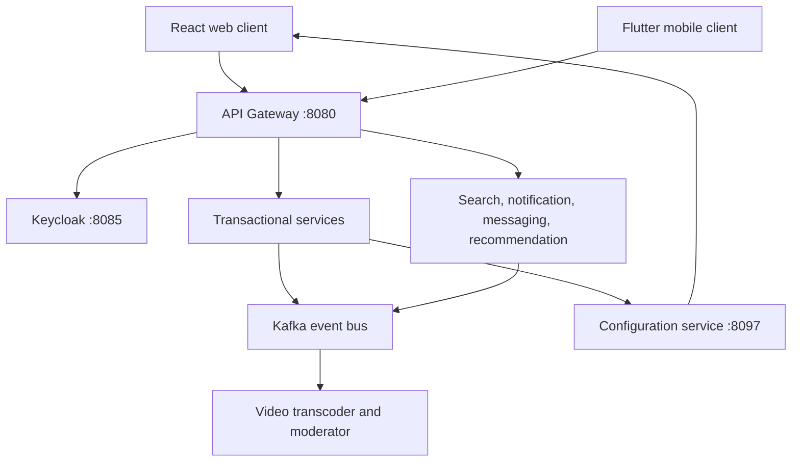

# VNShop Architecture and Service Guide

> Status snapshot: 2026-07-22. This document describes the repository as it exists at `main`.
> It is an engineering reference, not a production-readiness approval. The readiness review is
> recorded in [`docs/PRODUCTION-READINESS-REVIEW.md`](docs/PRODUCTION-READINESS-REVIEW.md).

## 1. System Boundary

VNShop is a Vietnamese multi-seller marketplace. The repository contains:

- 19 backend services across Spring Boot, NestJS, and Python.
- A React 18/Vite web client and a Flutter mobile client.
- PostgreSQL, Redis, Kafka, Elasticsearch, MongoDB, MinIO/S3, TimescaleDB, Keycloak, and observability tooling.
- Docker Compose for local integration and Kubernetes/Argo CD manifests for staging and production promotion.

The public request boundary is the API Gateway on port `8080`. Clients should not call the internal
service ports directly. Service-to-service calls use internal DNS, REST, gRPC, or Kafka depending on
the consistency requirement.

## 2. Runtime Topology



### Environments

| Environment | Source of runtime values | Intended use | Important constraint |
| --- | --- | --- | --- |
| Local Compose | `.env`, Compose environment, local volumes | Developer integration and E2E | Local credentials and stubs are expected. |
| Local staging-like Compose | `infra/compose/staging/docker-compose.staging.yml` | Manual integration rehearsal | It is explicitly local and must not be treated as production. |
| Kubernetes staging | `infra/k8s/overlays/staging` plus cluster secrets | Shared staging | Must use real image digests and non-local provider policy. |
| Kubernetes production | `infra/k8s/overlays/prod` plus secret manager/Sealed Secrets | Production promotion | The current manifest still contains placeholder digests and an empty SealedSecret; see the review ledger. |

### Deployment flow

1. CI builds and scans service images.
2. Images are published to GHCR.
3. The deployment repository/manifests pin images by digest.
4. Argo CD reconciles the selected overlay.
5. Kubernetes injects non-secret configuration from the overlay ConfigMap and credentials from `vnshop-runtime-secrets`.
6. Readiness probes gate traffic while liveness probes restart unhealthy workloads.

The repository currently has the deployment shape, but promotion is not production-ready until the
image digests, sealed secrets, provider modes, and external endpoints are supplied for the target
environment.

## 3. Service Catalog

### 3.1 Edge and identity

#### `api-gateway` - port 8080

- **Role:** Single public HTTP/WebSocket entry point.
- **Owns:** Route mapping, JWT resource-server validation, CORS, rate limiting, circuit breakers, security headers, correlation IDs, and the common API error envelope.
- **Dependencies:** Redis for rate-limit state, Keycloak issuer/JWK endpoints, and internal service DNS.
- **Boundary:** It is an adapter and policy layer. Domain rules belong in downstream services.
- **Readiness:** Core edge path is implemented. Production requires environment-provided issuer, Redis, CORS origins, TLS termination, and route targets; the local `application.yml` defaults to localhost when those values are absent.

#### `user-service` - port 8081

- **Role:** Buyer and seller identity data inside the marketplace bounded context.
- **Owns:** Registration, auth session/refresh flow, buyer profiles, seller profiles and approval, addresses, wishlist, public seller discovery, and GDPR export/delete use cases.
- **Dependencies:** PostgreSQL schema `user_svc`, Redis, Kafka, Keycloak admin/public endpoints, product-service seller statistics, and object storage for user media.
- **Boundary:** Native user data and marketplace profile policy stay here; Keycloak remains the identity provider.
- **Readiness:** Good domain/application separation and focused tests are present. Production still depends on non-local Keycloak URLs, database credentials, Kafka credentials, object storage, and callback origins.

### 3.2 Catalog and discovery

#### `product-service` - port 8082

- **Role:** Seller catalog and buyer-facing product context.
- **Owns:** Products, variants, categories, product eligibility/publication, images, reviews, questions, and seller product counts.
- **Dependencies:** PostgreSQL schema `product_svc`, Redis, Kafka, and S3-compatible object storage.
- **Events:** Publishes catalog/product changes for search and downstream projections.
- **Readiness:** Uses application/domain/infrastructure separation and cursor-based catalog reads. Production requires real storage endpoints/credentials, Kafka ACLs, and a production moderation/storage policy.

#### `search-service` - port 8086

- **Role:** Search read model and faceted product discovery.
- **Owns:** Search projections, full-text queries, filters, facets, cursors, and search-specific eligibility.
- **Dependencies:** PostgreSQL schema `search_svc`, Elasticsearch, Kafka product events, Redis, and Keycloak for protected operations.
- **Boundary:** Search is a disposable/read-optimized projection; product-service remains the catalog source of truth.
- **Readiness:** Query and projection code is present. Production requires authenticated Elasticsearch, a reindex/bootstrap procedure, and external GeoIP data when location features are enabled.

#### `recommendations-service` - port 8094

- **Role:** Frequently-bought-together and related-product recommendations.
- **Owns:** Co-purchase aggregation, processed-order idempotency, product projections, and recommendation queries.
- **Dependencies:** PostgreSQL, Kafka order/product events, and product-service REST calls.
- **Readiness:** The event projection and idempotency boundaries exist. It is a best-effort read model and should degrade as an explicit empty recommendation result, not by silently switching to local demo data.

### 3.3 Cart and checkout

#### `cart-service` - port 8084

- **Role:** Authenticated cart persistence and guest-cart merge boundary.
- **Owns:** Cart items, quantities, item limits, expiry policy, product snapshots, add/update/remove/clear, and the authenticated merge use case.
- **Dependencies:** Redis as the hot cart store, PostgreSQL/MikroORM migration support where enabled, and product-service for current product validation.
- **Boundary:** Cart owns cart intent; product and inventory own availability and stock truth.
- **Readiness:** Domain tests cover quantity and merge behavior. Production requires Redis URL/auth configuration and one authoritative consent-gated merge path in the client/server contract.

#### `order-service` - port 8091

- **Role:** Commerce transaction and fulfillment orchestration.
- **Owns:** Checkout, orders, sub-orders, coupon ownership/redemption, return and dispute workflows, invoice requests, saga state, outbox records, and order/finance projections.
- **Dependencies:** PostgreSQL schema `order_svc`, Redis, Kafka, inventory/payment/shipping gRPC clients, product and coupon ports, and configuration-service.
- **Events:** Coordinates order, payment, inventory, shipping, return, refund, payout, and invoice events through outbox-backed transitions.
- **Boundary:** It owns order lifecycle state; it does not own payment ledger balances, stock, shipment state, or seller wallet balances.
- **Readiness:** It has the widest money-path surface and the strongest test coverage in the repository. Production requires durable outbox relay/claim monitoring, Kafka ACLs, gRPC target configuration, idempotency, and end-to-end compensation tests.

#### `coupon-service` - port 8088 (legacy)

- **Role:** Legacy coupon CRUD, validation, and usage tracking.
- **Owns:** Coupon terms, discount rules, activation/deactivation, and usage persistence in the older service boundary.
- **Dependencies:** PostgreSQL, Redis, Kafka, and Keycloak.
- **Boundary:** Current checkout ownership is moving toward order-service. This service must be treated as a compatibility/migration source until the deployment and API ownership decision is completed.
- **Readiness:** The code is testable, but its deployment status is ambiguous: it remains in the Compose service graph while project documentation calls it archived. Do not promote it without an explicit ownership decision.

### 3.4 Payment, shipping, and finance

#### `payment-service` - port 8092

- **Role:** Payment intent, provider callback, ledger, status, and refund boundary.
- **Owns:** Payment records, idempotency keys, provider adapters, COD/VietQR/SePay/Stripe/PayPal/VNPay/MoMo policy, IPN/webhook handling, FX conversion, and refund requests.
- **Dependencies:** PostgreSQL schema `payment_svc`, Kafka, provider APIs, configuration-service, and Keycloak.
- **Events:** Publishes payment completion, failure, refund-requested, and refunded events for the order saga.
- **Readiness:** COD/VietQR and provider adapters are represented, but the current repository explicitly exposes stub/demo/sandbox/disabled modes. FX conversion has a configured fallback rate, which must be changed to a fail-closed or approved stale-rate policy for real money flows.

#### `shipping-service` - port 8093

- **Role:** Carrier abstraction and shipment lifecycle.
- **Owns:** Carrier quotes, labels, tracking, shipment cancellation, GHN/GHTK adapters, webhook authentication, status mapping, and webhook outbox relay.
- **Dependencies:** PostgreSQL schema `shipping_svc`, Kafka, carrier APIs, and gRPC clients.
- **Events:** Publishes shipment created, updated, cancelled, and carrier status transitions.
- **Boundary:** Carrier-specific payloads stay in adapters; the domain exposes carrier-neutral shipment concepts.
- **Readiness:** Webhook acknowledgment now depends on durable outbox acceptance, but `CARRIER_MODE` defaults to `stub`, GHN defaults to a dev endpoint, and carrier credentials are optional. Production must inject live mode, live endpoints, credentials, callback security, and relay observability.

#### `seller-finance-service` - port 8090

- **Role:** Seller wallet and payout bounded context.
- **Owns:** Wallet credits/debits, commission calculation, commission tiers, payout requests/processing, transaction history, and refund debits.
- **Dependencies:** PostgreSQL schema `seller_finance_svc`, Redis, Kafka order/payment events, and Keycloak admin/seller roles.
- **Boundary:** It is the accounting projection for seller balances; payment-service owns external payment state.
- **Readiness:** Refund idempotency and commission propagation are implemented. Production needs reconciliation, payout provider integration/controls, audit retention, and a business-owned commission configuration.

#### `invoice-service` - port 8098

- **Role:** Vietnamese electronic invoice generation and submission boundary.
- **Owns:** Invoice aggregates, seller authorization, XML generation, invoice status, and GDT submission integration.
- **Dependencies:** PostgreSQL schema `invoice_svc`, Kafka order-confirmed events, configuration-service, Keycloak, and the external GDT API when enabled.
- **Readiness:** XML generation and ownership checks are present. The seller tax identity in the central config is a placeholder and must be replaced before any legal invoice flow is enabled.

### 3.5 Communication and notification

#### `notification-service` - port 8087

- **Role:** User notification delivery and inbox.
- **Owns:** Notification threads, per-channel preferences, unread/read state, delivery policy, retries, and in-app/WebSocket delivery.
- **Dependencies:** MongoDB, Redis, Kafka, SMTP/SES, SMS, FCM/OneSignal, and Keycloak.
- **Events:** Consumes order, payment, shipping, review, and account events and translates them into user notifications.
- **Readiness:** Domain-level channel filtering, deduplication, and retry use cases exist. Email/SMS providers are disabled by default and require real credentials, delivery limits, bounce handling, and operational dashboards.

#### `messaging-service` - port 8095

- **Role:** Buyer-seller direct messaging.
- **Owns:** Threads, messages, read state, idempotency, REST APIs, and WebSocket fan-out.
- **Dependencies:** PostgreSQL/MikroORM, Redis/socket state, Kafka event integration, and JWT validation.
- **Readiness:** The module has domain/application/infrastructure separation and WebSocket tests. Production requires connection limits, abuse/rate controls, retention policy, and external client origin configuration.

#### `monitoring-service-v2` - port 8096

- **Role:** Application health, metrics, service discovery, OpenAPI aggregation, and monitoring WebSocket surface.
- **Owns:** Health checks, metric persistence, alert entities, service discovery metadata, OpenAPI aggregation, and dashboard endpoints.
- **Dependencies:** TimescaleDB/PostgreSQL, Prometheus, gateway/service health endpoints, Redis where configured, and Keycloak roles.
- **Readiness:** It is an operations service, not a business source of truth. Production requires secure scrape endpoints, alert routing, retention sizing, and a clear distinction between platform health and business health.

### 3.6 Media pipeline

#### `video-transcoder` - worker

- **Role:** Asynchronous video processing.
- **Owns:** Transcode jobs/results, FFmpeg command construction, input/output object storage, and completion events.
- **Dependencies:** Kafka, S3-compatible object storage, FFmpeg, and a worker filesystem (tmpfs is required for staging files).
- **Readiness:** Command construction and checksum tests exist. Production requires resource quotas, media limits, malware/content controls, tmpfs enforcement, and durable retry/dead-letter handling.

#### `video-moderator` - worker

- **Role:** Asynchronous ML content classification and moderation decisions.
- **Owns:** Moderation consumption, model invocation/classification, result publication, and moderation artifacts.
- **Dependencies:** Kafka, object storage, Python ML/runtime dependencies, and its worker database/configuration where enabled.
- **Readiness:** The worker is deployable in the topology, but model versioning, confidence thresholds, human review, and failed-job replay must be operationalized before relying on it for enforcement.

## 4. Cross-Service Contracts

### Kafka

Kafka is the asynchronous integration boundary. The repository uses SASL authentication and per-service
ACLs in the main stack. Important event families include:

| Family | Producers | Consumers / projections |
| --- | --- | --- |
| `order.*` | order-service | finance, recommendations, notification, invoice |
| `payment.*` | payment-service | order-service, finance, notification |
| `inventory.*` | inventory-service | order-service, notification |
| `shipping.*` | shipping-service | order-service, notification |
| `product.*` | product-service | search, recommendations, notification |
| `return.*` | order-service | payment, finance, notification |
| `video.*` | video workers/product | product and moderation workflows |

Money-path events use outbox persistence and idempotent consumers. A producer acknowledgment, outbox
claim timeout, retry policy, and dead-letter policy are part of the contract, not incidental implementation
details.

### gRPC

The generated contracts in [`proto/`](proto/) cover:

- Inventory reserve/release.
- Payment request/status.
- Shipping request/label response.

The order service is the main synchronous orchestrator. Production deployments must inject the gRPC
hostnames and ports; local defaults use `localhost` for developer convenience.

### Storage ownership

Each transactional bounded context owns its schema and migrations. Redis is used for carts, caches,
rate limiting, deduplication, and transient connection state. Elasticsearch and recommendation/search
tables are projections, not authoritative product/order stores. MinIO is the local S3-compatible backend;
production must use the configured R2/S3-compatible endpoint and credentials.

## 5. Configuration Ownership

Configuration has three layers:

1. **Environment/runtime configuration:** endpoints, credentials, security modes, feature gates, and deployment identity.
2. **Configuration service:** business configuration in [`services/configuration-service/config/services.yml`](services/configuration-service/config/services.yml), exposed through authenticated service endpoints and a public client-safe projection.
3. **Service-local application files:** binding defaults and local developer fallbacks.

The third layer must never silently decide a production dependency. Current code still contains local
defaults in Java `application.yml` files, the web API endpoint module, and the mobile environment loader.
The complete evidence and remediation order are in the production-readiness review.

## 6. Security and Operations Baseline

- Keycloak is the identity provider; access tokens are validated at the gateway and service boundaries.
- Browser refresh tokens use an httpOnly cookie flow; the frontend should keep access tokens out of persistent storage.
- Kafka uses SASL and per-service credentials in the main deployment path.
- Kubernetes workloads run as non-root with restricted capabilities and read-only filesystems where configured.
- Health probes, Prometheus metrics, traces, logs, backups, and alert rules are present in `infra/`.
- Secrets must be supplied through a platform secret manager or Sealed Secrets. `.env`, `.env.secrets`, rendered Kafka JAAS files, and private keys are ignored and must never be committed.

The baseline is not equivalent to a production approval. An empty sealed-secret payload, placeholder
image digests, non-live provider modes, and missing external credentials are release blockers.

## 7. Delivery Gates

Run focused tests for the changed service, then the repository gates:

```bash
node infra/scripts/e2e-day.mjs
cd fe && npx playwright test
```

Additional gates include Java Maven tests/JaCoCo, NestJS Jest tests, Flutter tests, protobuf/Buf checks,
OpenAPI validation, dependency scanning, container scanning, and Kubernetes manifest rendering.

Before a production promotion, require all of the following:

- Real image digests exist and are pullable.
- Sealed Secrets contain encrypted values for every referenced runtime key.
- Public origins, OAuth callbacks, Kafka/DB/Redis/Elasticsearch endpoints, and storage URLs are real for the target environment.
- Carrier and payment modes are explicitly selected; no `stub`, `demo`, or unapproved `sandbox` provider is enabled.
- FX fallback behavior is approved for money paths.
- Invoice seller identity is real and legally approved.
- Backup restore and dead-letter replay have been exercised.
- Provider webhooks and Kafka/outbox failure paths have security-enabled integration coverage.

## 8. Change Guide

When changing a service boundary:

1. Update the service section in this file and the service inventory in `README.md`.
2. Update the relevant `.agents/AGENTS.md` or service handover.
3. Change the domain/application contract before adapters.
4. Add focused unit, integration, and contract tests.
5. Update Compose, Kubernetes, secrets, and CI references together.
6. Run the affected service tests and both end-to-end gates.
7. Record any deferred production work in [`docs/PRODUCTION-READINESS-REVIEW.md`](docs/PRODUCTION-READINESS-REVIEW.md).
