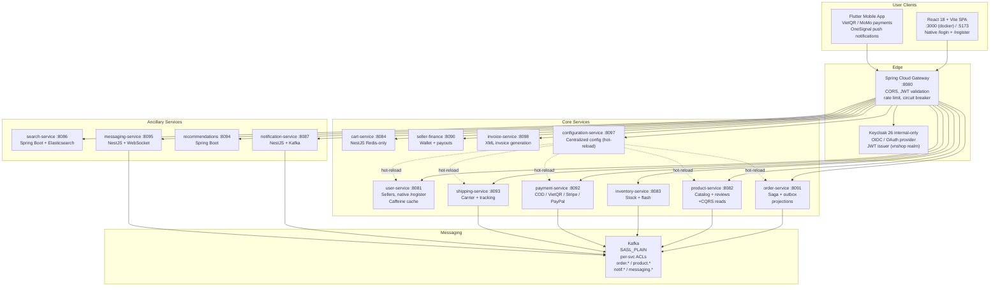

# VNShop — Multi-Seller Retail Marketplace

A polyglot microservices e-commerce platform demonstrating DDD, CQRS, hexagonal architecture, and event-driven sagas, with a React SPA and Flutter mobile app.

VNShop is a portfolio full-stack project for a Vietnamese multi-seller marketplace inspired by Shopee, Lazada, and Tiki. It ships with: 19 services (Spring Boot + NestJS), per-service Postgres, Kafka (SASL-authenticated + per-service ACLs) + saga + outbox, Keycloak-backed httpOnly-cookie auth, a React + Vite SPA, and a Flutter mobile app with OneSignal push notifications and VietQR/MoMo payment integration. The current branch is `main` at merge `1cd5495f` (PR #314, 2026-08-17), which completes the backend live-shipping checkout contract. The latest documented local Docker evidence is `e2e-day.mjs` (66/66 API checks) and Playwright (202 passed, 2 skipped, 204 total); rerun both after the shipping-contract merge before treating those counts as fresh release evidence.

## System Requirements

- **Minimum RAM:** 16GB (full stack uses ~12GB)
- **Recommended RAM:** 32GB
- **Docker Desktop:** Allocate at least 12GB
- **Disk:** 10GB+ free for images and volumes

## Quick Links

| Resource | Use it for |
| --- | --- |
| [HANDOFF.md](HANDOFF.md) | **Start here.** Single-page pickup doc for someone new to the codebase. |
| [Architech.md](Architech.md) | Source-linked service architecture, code maps, end-to-end workflows, state machines, fallbacks, and deployment model. |
| [Admin dashboard data-flow findings](docs/ADMIN-DASHBOARD-DATA-FLOW-FINDINGS.md) | v2 report snapshot, refund ledger, realized revenue, CSV export, seller-name enrichment, and verification gates. |
| [Production readiness review](docs/PRODUCTION-READINESS-REVIEW.md) | Dated review of local fallbacks, hardcoded infrastructure, provider modes, and release blockers. |
| [Full-stack evidence review](fe/e2e/evidence/full-audit/EVIDENCE-REVIEW.md) | Final API/Playwright/Agent Browser proof, independent review findings, fixes, and remaining release blockers. |
| [Final verification record](fe/e2e/evidence/full-audit/FINAL-VERIFICATION.md) | Exact commands, counts, Docker readiness evidence, and the final local-vs-production gate decision. |
| [CI pipeline](docs/CI-PIPELINE.md) | Required GitHub Actions jobs, local reproduction commands, and release-gate behavior. |
| [Architecture doc](docs/architect/SYSTEM-ARCHITECTURE.md) | Full system design, bounded contexts, API conventions |
| [Status reality](docs/STATUS-REALITY-2026-05-14.md) | Historical reconciliation of service health, feature coverage, and known gaps |
| [Audit summary 2026-05-21](docs/AUDIT-SUMMARY-2026-05-21.md) | Consolidated security audit ledger (pt12 → pt23) — 18 findings closed across 7 services |
| [E2E audit 2026-05-18](docs/E2E-AUDIT-2026-05-18.md) | What `e2e-day.mjs` and Playwright cover, plus the bugs fixed during the buildout |
| [Current session handover](docs/SESSION-HANDOVER-2026-08-18.md) | Post-PR #314 status, blockers, and next steps |
| [Historical session handover](docs/SESSION-HANDOVER-2026-07-10.md) | July implementation handover |
| [Penetration test report](docs/PENETRATION-TESTING-REPORT-2026-07-11.md) | Security verification results and remaining findings |
| [Release and recovery runbook](docs/operations/release-and-recovery.md) | Release, rollback, and recovery operating procedure |
| [Frontend README](fe/README.md) | React + Vite SPA setup, scripts, layout |
| [Mobile README](vnshop_mobile/README.md) | Flutter mobile app setup, payment integration |
| [Docker Compose](docker-compose.yml) | Local infrastructure and service definitions |

For a chronological view of what shipped, walk the handover series in `docs/SESSION-HANDOVER-2026-05-{17..29}-pt{0..44}.md`, `docs/SESSION-HANDOVER-2026-06-*.md`, and the July handover reports. For the day-to-day pickup case, [HANDOFF.md](HANDOFF.md) is enough.

## Current Production Readiness

The repository has a working local integration topology and substantial domain/test coverage. The
2026-07-22 closure round completed the main repository-owned reliability fixes: carrier webhook
authentication and durable acceptance, Kafka acknowledgement handling, product event delivery and
search repair, atomic authenticated cart merge, fail-closed inventory reservation, and notification
retry persistence. The detailed implementation evidence is maintained in
[`docs/PRODUCTION-READINESS-REVIEW.md`](docs/PRODUCTION-READINESS-REVIEW.md).

The Kubernetes promotion artifacts are still **not production-ready**. Before treating a deployment as
live, resolve the empty SealedSecret, replace all-zero image digests, select live carrier/payment modes,
provide independent provider secrets, secure the shared Kafka and Elasticsearch topology, and remove or
gate server-side localhost/stub/demo fallbacks. PR #314 now carries carrier contact, address-code, parcel,
declared-value, and COD fields through the order-to-shipping gRPC contract. The remaining browser checkout
gap is that the React storefront intentionally fails closed because product/cart responses do not yet expose
trusted parcel dimensions; the API harness can provide those fields, but the real browser checkout cannot
submit until an authoritative product/variant parcel-data contract is added. The execution order and proof gates are in
[`docs/PRODUCTION-READINESS-CLOSURE-PLAN.md`](docs/PRODUCTION-READINESS-CLOSURE-PLAN.md).

The immediate engineering sequence is: add trusted parcel metadata to the product/cart/checkout contract,
run live-shipping and compensation verification, then close Kubernetes and provider evidence gates. The
August admin cursor-pagination plan is the next feature backlog after these release-blocking checks; the
older May-July handover and roadmap files are historical archives.

Local-only values are intentional in `.env.example` and `infra/compose/staging/docker-compose.staging.yml`.
They are documented for developer setup and must never be copied into shared staging or production. The
architecture source of truth for service ownership and cross-service contracts is [`Architech.md`](Architech.md).

## Architecture Overview



## Project Status

The repository records these baseline integration gates:

| Suite | Result | Coverage |
| --- | --- | --- |
| `node infra/scripts/e2e-day.mjs` | **65/65 PASS** | Single-day flow: register → login (buyer/seller/admin) → catalog → public sellers → seller fulfilment → cart → wishlist → checkout (live shipping rate quote) → order → coupon validate + apply → admin seller approval → saga compensation (cancel + return + refund) → messaging WebSocket handshake → reviews + Q&A → recommendations → admin dashboards → user profile → video moderation |
| `cd fe && npx playwright test` | **108/108 PASS** | Real browser against dockerised FE: smoke, buyer happy path, authenticated routes, role guards, search, public sellers, guest cart, seller dashboard, admin panel, video integration, journey flows |

The July 22 closure verification was focused on the changed reliability paths. Java shipping,
inventory, payment outbox, order adapter, product outbox, and search repair tests passed. Cart tests
and typechecks passed in both the cart service and frontend; notification passed 27 suites / 271 tests.
The cart E2E module graph is healthy but its full run remains environment-gated on `DATABASE_URL`,
PostgreSQL, and Redis.

Historical baseline unit tests (2026-06-21):

| Service | Tests |
| --- | --- |
| order-service | 132/132 |
| user-service | 141/141 |
| payment-service | 89/89 |
| notification-service | 89/89 |
| product-service | 33/33 |
| seller-finance-service | 20/20 |
| FE vitest | 169/169 |
| FE typecheck | 0 errors |

### Recent shipped (2026-07-10 through 2026-07-22)

- **Flutter mobile app** (2026-07-10). VNShop mobile app with VietQR/MoMo payment integration, OneSignal push notifications, BLoC state management, Vietnamese/English localization, and Material 3 design system.
- **Production-readiness reliability closure** (2026-07-22). Payment callbacks, shipping webhooks, product events, and search projection repair now use durable delivery boundaries; Kafka failures remain retryable instead of being acknowledged early. Missing inventory projections reject reservation, and notification retries persist retry/DLQ state.
- **Shipping webhook hardening** (2026-07-22). GHN/GHTK callbacks use explicit public routes, shared application workflow, typed provider/security/retry configuration, fail-closed signature verification, idempotent durable acceptance, and `503` responses when durable delivery cannot be recorded.
- **Live-shipping checkout contract** (2026-08-14 to 2026-08-17, PR #314). Carrier contact/address codes, parcel dimensions, declared value, COD amount, recovery persistence, label persistence, carrier cancellation, and compensation-topic wiring now cross the order/shipping boundary. The browser still needs trusted parcel metadata from product/cart responses before it can submit live checkout.
- **Consent-gated cart merge** (2026-07-22). Guest and server quantities are combined by intent through one authenticated atomic/idempotent merge operation; the browser effect cannot bypass the user's keep-separate choice.
- **Service-owned operator read models** (2026-07-22). Admin orders and disputes are contextualized by `order-service`, payouts by `seller-finance-service`, and review queues by `product-service`; buyer/shop/product labels are batch-resolved through `user-service` public-profile APIs instead of frontend UUID fallbacks. The remaining operator risk is bounded pagination and live PostgreSQL integration coverage. See [`docs/FE-DATA-SEARCH-REVIEW-2026-07-22.md`](docs/FE-DATA-SEARCH-REVIEW-2026-07-22.md) and [`Architech.md`](Architech.md).
- **CI and runtime hardening** (2026-07-22). The required `CI Gate` aggregates repository, frontend, mobile, Java, Node, Python, protobuf, secret-scan, and container checks. Notification runtime dependencies are pinned and included in its image. See [`docs/CI-PIPELINE.md`](docs/CI-PIPELINE.md).
- **Admin dashboard financial closure** (2026-07-23). The dashboard now reads one server-snapshotted v2 report, records idempotent confirmed refunds in `order_svc.refund_ledger`, exposes `refundedAmount` and `realizedRevenue`, and downloads a bounded CSV using the page's `asOf` snapshot. Runtime migration, gateway, and browser evidence remains blocked while Docker is unavailable. See [`docs/ADMIN-DASHBOARD-DATA-FLOW-FINDINGS.md`](docs/ADMIN-DASHBOARD-DATA-FLOW-FINDINGS.md).

### Previous shipped (2026-06-09 → 2026-06-21)

- **Ponytail over-engineering cleanup** (2026-06-21). Codebase-wide audit removed ~1,100 lines of dead code, test duplication, and infra bloat across 9 commits: dead FE hooks/components deleted, 35 test-helper duplicates consolidated into shared modules, unused Redis HA stack (6 services) removed, `spring-boot-devtools` dropped from 3 services, manual `@Repository` JPQL replaced with Spring Data, YAGNI application-layer wrappers inlined, test-the-framework tests deleted, `ConfirmDialog` rebuilt as thin `Modal` wrapper.
- **Centralized configuration service** (2026-06-09). NestJS service at `:8097` with YAML-backed business config. Java services fetch on startup via `ConfigServiceClient`; hot-reload via `POST /api/config/reload`. Extracted hardcoded constants (currency, invoice template, payment methods, shipping thresholds) into `services/configuration-service/config/services.yml`.
- **Invoice service** (2026-06-09). Spring Boot service at `:8098` generates XML invoices per Vietnamese e-invoice spec. JAXB marshalling, buyer/seller ownership checks, Kafka integration.
- **Kafka SASL + ACL security hardening** (pt49). Broker switched to `SASL_PLAINTEXT` with per-service credentials and `StandardAuthorizer` ACLs. Prevents event forgery between bounded contexts.
- **Refund saga fix** (pt49, P0). Topic name mismatch (`payment.refund_requested` vs `payment.refund.requested`) silently killed the entire refund flow. Fixed + deterministic saga compensation wired end-to-end.
- **gRPC Docker networking fix** (pt49, P0). Localhost-hardcoded gRPC hosts replaced with Docker DNS env vars. All saga cross-service calls (inventory ↔ payment ↔ shipping) now work in containers.
- **OWASP security audit — 50 findings** (pt48). 18 fixed: product-service auth on mutations, gateway seller role guards, admin role defense-in-depth, rate limiting on `/auth/**`, security headers, pagination caps, DB password externalization, Redis auth.
- **Notification preferences enforcement** (pt48). `SendNotificationUseCase` checks per-channel preferences before delivery; WebSocket filters catch-up notifications on reconnect.
- **Cart cleared after checkout** (pt49). Fire-and-forget cart clear on successful order placement.
- **CI pipeline** (2026-06-05). GitHub Actions with OWASP dependency check, Buf protobuf lint, Trivy container scanning, BuildKit caching, Jest/vitest/Playwright gates.

### What's left / deferred

| # | Item | Status | Blocker |
|---|------|--------|---------|
| 1 | R2 swap for avatar storage | Ready (checklist in `docs/R2-SWAP-CHECKLIST.md`) | R2 credentials |
| 2 | PayPal sandbox manual smoke | All code committed + unit-tested | `PAYPAL_CLIENT_ID`/`SECRET` |
| 3 | Per-seller commission tier on SubOrder | Design ready, hardcoded to STANDARD | Business decision |
| 4 | VNPay payment method | Phase 3 | Business registration (MST + GPKD) |
| 5 | Notifications inbox (FE bell) | Kafka consumer + FE bell icon shipped | — |
| 6 | Complete live GHN/GHTK checkout contract | Backend/protobuf contract is merged in PR #314; browser checkout is fail-closed until trusted parcel metadata is exposed by product/cart, and live-provider proof remains external | Product/cart parcel contract, provider contract, and credentials |
| 7 | Native password reset / 2FA | Bounces to Keycloak account console | Design decision |
| 8 | Email verification flow | Currently auto-verified on register | Design decision |
| 9 | Hero/promo/trending CMS for HomePage | Stubs via `<ComingSoonCard>` | Content strategy |
| 10 | Automatic config propagation | Manual hot-reload via `POST /api/config/reload` works; push/event propagation is not implemented | Webhook/event push |
| 11 | Remaining OWASP findings (32/50) | Tracked in security audit docs | Architectural effort |
| 12 | monitoring-service TypeORM drift | `service_id` column missing in entity | Schema fix |
| 13 | Production deployment contract | Kubernetes secrets, image digests, provider modes, Kafka/Elasticsearch security, and public origin validation remain external release gates | Staging/production operations |

### Service ownership at HEAD

```mermaid
flowchart TB
  GW[api-gateway :8080]
  KC[Keycloak internal-only]
  FE[frontend :3000]
  MOB[Flutter Mobile]

  subgraph CoreSpringBoot
    U[user-service :8081]
    P[product-service :8082]
    O[order-service :8091]
    I[inventory-service :8083]
    S[search-service :8086]
    PAY[payment-service :8092]
    SHIP[shipping-service :8093]
    SF[seller-finance :8090]
    R[recommendations :8094]
    INV[invoice-service :8098]
  end

  subgraph NestJS
    C[cart-service :8084]
    N[notification-service :8087]
    M[messaging-service :8095]
    CFG[configuration-service :8097]
  end

  FE --> GW
  MOB --> GW
  GW --> KC
  GW --> U & P & O & I & C & S & N & CFG & PAY & SHIP & SF & R & M & INV

  CFG --> ConfigYAML[Centralized business config, hot-reload, per-service + global]
  U --> SellerProfile[Buyers, sellers, addresses, wishlist, native /auth/register]
  P --> Catalog[Catalog, variants, images, reviews, questions, public seller stats batch]
  O --> Commerce[Orders, sub-orders, checkout, coupons, saga, outbox, payouts, finance]
  I --> Stock[Stock, reservations, flash sale]
  C --> Cart[Redis cart + cart-service round-trip]
  S --> Search[Elasticsearch index + faceted search]
  N --> Notify[Email, SMS, push, in-app via Kafka]
  M --> Chat[Buyer-seller chat, REST + WebSocket]
  PAY --> Payments[Intent + reconciliation; VNPAY/MoMo surface]
  SHIP --> Shipping[Shipment creation + tracking]
  SF --> Wallet[Seller wallet + payouts]
  R --> Recs[Frequently-bought-together via co-purchase aggregator]
  INV --> Invoice[XML invoice generation per VN e-invoice spec]
```



## Tech Stack

| Area | Technology |
| --- | --- |
| Java services | Java 25 LTS, Spring Boot 4.1.0, Spring Cloud Gateway, Maven 3.9 |
| Node services | Node.js 24 LTS, NestJS 11 |
| Frontend | React 18.3, Vite 6.3, TanStack Query 5, react-router 7, i18next 26, zod 4, Tailwind v4 |
| Mobile | Flutter 3.44, BLoC state management, Dio HTTP, OneSignal push |
| Identity | Keycloak 26.6 (`vnshop` realm) internal-only, native cookie auth via gateway, JWT |
| Data stores | PostgreSQL 17.9 (per-service), Redis 8.6, Elasticsearch 9.4.0, MinIO (S3-compatible) |
| Messaging | Kafka (`confluentinc/cp-kafka:8.2.0`), SASL_PLAINTEXT + per-service ACLs, outbox pattern, saga orchestration |
| Payments | COD, VietQR, SePay (live); Stripe, PayPal (sandbox-ready, full refund saga); VNPay deferred; MoMo fully implemented (`MOMO_ENABLED=false` default) |
| Inter-service | gRPC (order↔payment↔shipping↔inventory), Kafka events, REST with Resilience4j |
| Observability | Jaeger (OTLP traces), Prometheus + Alertmanager, Loki, Grafana, Kafka producer health probes |
| Resilience | Resilience4j circuit breaker + retry, Caffeine + Redis cache, idempotent consumers |
| Security | OWASP audit (50 findings, 18 fixed), rate limiting, security headers, DB/Redis password externalization |
| Quality | JaCoCo (Java), vitest + Playwright (FE), Jest (NestJS), 90% coverage target |
| CI/CD | GitHub Actions, OWASP dependency check, Buf protobuf lint, Trivy container scan, BuildKit |
| Runtime | Docker, Docker Compose, virtual threads (Java 25) |

## Quick Start

Stand up the secure local base (frontend + gateway are the host entry points):

```bash
docker compose --profile apps up -d
```

For explicit workstation debugging and direct infrastructure inspection, opt in
to the loopback-only development overlay:

```bash
docker compose -f docker-compose.yml -f docker-compose.dev.yml --profile apps up -d
```

The development overlay is never auto-loaded. It publishes developer-only ports
on `127.0.0.1` and enables loopback JDWP for selected Java services. Do not use
it for shared staging or production.

One-time post-import setup for the internal Keycloak admin client (idempotent; no host port is published):

```bash
bash infra/scripts/setup-keycloak-admin-client.sh
```

Pre-create Kafka consumer-side topics so messaging-service doesn't crash on startup (idempotent; runs `kafka-topics --create --if-not-exists`):

```bash
bash infra/scripts/init-kafka-topics.sh
```

Seed the demo catalog so the storefront has products to render (skips when catalog is non-empty; `FORCE=1` to overwrite):

```bash
node infra/scripts/seed-demo.mjs
```

Verify the stack is healthy with both gates:

```bash
node infra/scripts/e2e-day.mjs       # 65/65 — day-in-the-life API smoke
cd fe && npx playwright test         # 108/108 — real browser FE-to-BE
```

If you see 503s on either suite, Spring Cloud Gateway's Resilience4j breaker has latched. Reset with `docker compose restart api-gateway`.

### Local access points

| URL | What opens |
| --- | --- |
| `http://localhost:3000` | Storefront SPA (React + Vite, dockerised bundle) |
| `http://localhost:5173` | Storefront SPA (Vite dev server, optional alternative) |
| `http://localhost:8080` | API gateway |
| Docker network only | Keycloak 26.6 identity provider; the admin console is not host-exposed |
| Docker network only | Elasticsearch |
| `http://localhost:16686` | Jaeger UI (explicit dev overlay only) |
| `http://localhost:9000` | MinIO console (explicit dev overlay only) |
| `http://localhost:9093` | Alertmanager (explicit dev overlay only) |
| Mobile (Flutter) | `cd vnshop_mobile && flutter run` — connects to API gateway at `localhost:8080` |

### Local development credentials

The values below are local-only examples. They are available only when the
explicit development environment/overlay is selected and must not be copied to
shared staging or production.

| System | Username | Password |
| --- | --- | --- |
| Keycloak bootstrap admin | `admin` | `admin` (container-only; use a controlled tunnel for administration) |
| PostgreSQL (all per-service DBs) | `vnshop` | `vnshop` |
| MinIO root | `minioadmin` | `minioadmin` |

### Test users (Keycloak realm `vnshop`, all password `test`)

- `buyer1` — BUYER role
- `seller1` — SELLER role (also has BUYER)
- `admin1` — ADMIN role (also has BUYER)

`/auth/register` creates additional fresh users at runtime; the E2E suite generates `e2e_buyer_<timestamp>@vnshop.local` accounts each run.

### Common service ports

```text
3000 frontend (docker)
5173 frontend (vite dev)
8080 api-gateway
8081 user-service
8082 product-service
8083 inventory-service
8084 cart-service
8085 keycloak (internal Docker port; not published)
8086 search-service
8087 notification-service
8088 coupon-service          (archived local migration source; never deployed)
8090 seller-finance-service
8091 order-service
8092 payment-service
8093 shipping-service
8094 recommendations-service
8095 messaging-service
8097 configuration-service
8098 invoice-service
```

### Per-service Postgres

```text
5432 postgres-legacy        (notification, coupon, seller-finance, recommendations, messaging schemas)
5433 postgres-user
5434 postgres-product
5435 postgres-order
5436 postgres-payment
5437 postgres-inventory
5438 postgres-search
5439 postgres-shipping
```

Stop the stack:

```bash
docker compose --profile apps down
```

## Service Map

This is the quick ownership map. See [`Architech.md`](Architech.md) for the full service boundaries,
dependencies, contracts, deployment topology, and per-service production notes.

| Service | Port | Tech | Profile | Owns |
| --- | ---: | --- | --- | --- |
| frontend | 3000 | React 18 + Vite 6 | apps | Storefront SPA, native `/login` + `/register`, role-gated routes |
| mobile | — | Flutter 3.44 | — | VietQR + MoMo payments, OneSignal push, BLoC state management |
| api-gateway | 8080 | Spring Boot, Spring Cloud Gateway | apps | Edge routing, OAuth2 resource server, CORS, rate limiting, circuit breakers |
| user-service | 8081 | Spring Boot | apps | Buyer + seller profiles, addresses, wishlist, native `/auth/register`, public seller endpoints (`GET /sellers`, `GET /sellers/{id}`) |
| product-service | 8082 | Spring Boot | apps | Seller catalog, categories, variants, product images, reviews, questions, batch seller stats endpoints |
| inventory-service | 8083 | Spring Boot | apps | Stock levels, reservations, flash sale inventory |
| cart-service | 8084 | NestJS | apps | Redis cart snapshots, buyer cart operations |
| search-service | 8086 | Spring Boot | apps | Elasticsearch search index, faceted queries |
| notification-service | 8087 | NestJS | apps | Kafka-driven email, SMS, push, in-app workflows |
| seller-finance-service | 8090 | Spring Boot | apps | Seller wallet, payouts, transactions |
| order-service | 8091 | Spring Boot | apps | Orders, sub-orders, checkout, coupon ownership and atomic redemption, saga orchestration, outbox, finance projections |
| payment-service | 8092 | Spring Boot | apps | Payment intents, COD + VietQR + SePay live, Stripe + PayPal sandbox-ready (full refund saga), VNPay deferred (see [PAYMENT-ROADMAP.md](docs/PAYMENT-ROADMAP.md)) |
| shipping-service | 8093 | Spring Boot | apps | Shipment creation, carrier integration, tracking |
| recommendations-service | 8094 | Spring Boot | apps | Frequently-bought-together via co-purchase aggregator |
| messaging-service | 8095 | NestJS | apps | Buyer-seller direct messaging (REST + WebSocket fan-out) |
| configuration-service | 8097 | NestJS | apps | Centralized business config (YAML-driven, per-service + global, hot-reload via POST /reload) |
| invoice-service | 8098 | Spring Boot | apps | XML invoice generation per VN e-invoice spec |
| monitoring-service-v2 | 8096 | NestJS | — | Prometheus metrics aggregation, service health dashboards |
| video-transcoder | — | Spring Boot | — | FFmpeg-based video transcoding, S3 input/output, Kafka events |
| video-moderator | — | Python Flask | — | Video content moderation via Kafka, ML-based classification |

## Architecture Patterns

VNShop uses four core patterns together:

| Pattern | How VNShop uses it |
| --- | --- |
| Domain-Driven Design | Each bounded context owns its language, aggregates, use cases, and Postgres schema |
| Hexagonal | Domain + application depend on ports. Spring/NestJS/JPA/Kafka live in adapters |
| CQRS | Order-service has order summary projection; product-service serves read-side queries; sellers expose batch read endpoints |
| Event-driven saga | Order, payment, inventory, shipping, notification, messaging flows publish + consume Kafka events; saga orchestrator + outbox + projections handle compensation |

### Hexagonal flow

```text
                 inbound adapters
          REST controllers, Kafka consumers
                       |
                       v
+------------------------------------------------+
| application layer                              |
| use cases, commands, queries, ports            |
+----------------------+-------------------------+
                       |
                       v
+------------------------------------------------+
| domain layer                                   |
| aggregates, value objects, domain services     |
| no Spring, NestJS, JPA, Kafka, or HTTP imports |
+----------------------+-------------------------+
                       |
                       v
                 outbound ports
       repositories, event publishers, gateways
                       |
                       v
                outbound adapters
       JPA, Redis, Kafka, Keycloak, RestClient, gRPC
```

When adding behavior, start in the domain model, expose it through an application use case, then connect adapters last.

## Production characteristics now in place

- **Centralized configuration service.** Business constants (currency, invoice templates, payment methods, shipping thresholds) live in `services/configuration-service/config/services.yml`. Java services fetch on startup via `ConfigServiceClient` with local `application.yml` fallback. Hot-reload via `POST /api/config/reload`.
- **Typed shipping configuration.** Carrier mode, carrier endpoints, checkout policy, webhook secrets, retry limits, and acknowledgement timeouts are bound through validated shipping configuration instead of controller-level constants.
- **Durable webhook delivery.** GHN/GHTK callbacks are accepted idempotently into the shipping outbox and return success only after durable storage; Kafka publication waits for acknowledgement and returns a retryable failure when delivery cannot be confirmed.
- **Durable product projections.** Product lifecycle events use a producer outbox, while search projection failures enter a repair queue instead of being silently marked complete.
- **Atomic cart merge.** The authenticated merge endpoint is consent-gated, idempotent, concurrency-safe, and sums guest quantities with server quantities in one persistence operation.
- **Fail-closed stock reservation.** A missing inventory projection rejects checkout rather than allowing an untracked reservation.
- **Notification retry state.** Failed notification delivery is persisted with retry and dead-letter transitions so provider outages remain observable and replayable.
- **Kafka SASL + ACL authentication.** Broker runs SASL_PLAINTEXT with per-service credentials (`svc-order`, `svc-payment`, etc.) and `StandardAuthorizer` ACLs. Prevents cross-context event forgery. Auto-topic creation disabled.
- **httpOnly cookie auth.** Refresh tokens live in the `vnshop_rt` cookie (HttpOnly, SameSite=Lax, Path=/auth, configurable Secure) issued by user-service. Access tokens are JS-memory-only. XSS can't bootstrap a new session.
- **Resilience4j** circuit breaker + retry on the user-service → product-service stats adapter (sliding window 10, failure rate 50%, 10s open, 3 half-open trial, 3-attempt retry with 200ms exponential backoff).
- **Caffeine** in-memory cache on the same adapter (5-minute TTL, 10k entries, `recordStats()` enabled).
- **Redis `@Cacheable`** on product-by-id and coupon-by-code for hot-path reads.
- **Pinned timeouts** on outbound HTTP — 1s connect / 2.5s read via shared `JdkClientHttpRequestFactory`.
- **Batch endpoints** kill N+1 on the SellerShowcase: `POST /reviews/seller-summaries` and `POST /products/counts` (≤100 ids each).
- **Cart guest mode** — anonymous users get a localStorage cart at `vnshop:guest-cart`; one-shot replay on first authenticated render preserves items across login.
- **Saga compensation E2E coverage** — cancel-before-fulfilment + return + refund driven through the saga + outbox + projection cycle.
- **PayPal refund saga** — full round-trip: return-completed → refund-requested (outbox) → PayPal refund (idempotent via PayPal-Request-Id) → payment.refunded → Return marked REFUNDED + seller wallet debited.
- **Idempotent consumers** — seller-finance `processed_refund` table prevents double-debit on Kafka redelivery; order-service state-based idempotency on Return status transitions.
- **Commission tier propagation** — `commissionTier` flows through the refund event chain so wallet debits match the original credit calculation.
- **FX audit trail** — PayPal payments persist `externalAmount`, `externalCurrency`, `fxRate`, `fxRateAt` for dispute support.
- **Kafka producer health probes** — `KafkaProducerHealthIndicator` on order, payment, product services surfaces broker connectivity in `/actuator/health`.
- **Kafka producers** declare explicit `JsonSerializer` for record payloads (default `StringSerializer` would silently drop them).
- **JSONB** columns use `@JdbcTypeCode(SqlTypes.JSON)` (the `columnDefinition = "jsonb"` only affects schema generation).
- **Audit columns** (`created_at`, `updated_at`) on all core tables (V17 + V18); saga and outbox have stable order numbers across restarts (millisecond-of-day prefix).
- **CORS** explicit on the gateway (`CorsConfigurationSource` bean + `setAllowCredentials(true)` for the cookie flow + `permitAll` on OPTIONS for `/**`).
- **Health probes** exposed via `/actuator/health` with `circuitbreakers` contributor enabled; Prometheus endpoint available.
- **Virtual threads** enabled on 11 servlet services (`spring.threads.virtual.enabled=true`).
- **BuildKit cache mounts** on 15 Dockerfiles (60-80% cold-build speedup).
- **OWASP security audit.** 50 findings identified (2 critical, 12 high, 24 medium, 12 low); 18 fixed: auth on mutations, seller/admin role guards, rate limiting on `/auth/**`, security headers (X-Frame-Options DENY, X-Content-Type-Options nosniff), max pagination caps, DB password externalization, Redis auth.
- **Notification preferences enforcement.** `SendNotificationUseCase` checks per-channel enable flags before delivery; WebSocket gateway filters catch-up on reconnect.
- **Deterministic saga compensation.** inventory-service publishes `inventory.released`, shipping-service publishes `shipping.cancelled`, payment refund carries `sagaId` pass-through. No more 5-minute timeout → FAILED fallback.

See [`docs/SESSION-HANDOVER-2026-05-19-pt4.md`](docs/SESSION-HANDOVER-2026-05-19-pt4.md#operational-gotchas--durable-rules--additions-to-the-pt3-list) for the durable rules learned along the way (Hibernate 7 single-row aggregate wrapping, Spring 4 PathPattern regex limits, AOP-only `@CircuitBreaker`, `@MappedSuperclass` retroactivity, cookie-based auth needing `credentials: "include"` on every call, etc.).

## Coding Convention

Follow these guardrails across services:

| Area | Rule |
| --- | --- |
| Java DTOs | Use `record`, not mutable classes — applies to commands, requests, responses, queries |
| JPA entities | Use Lombok `@Getter`/`@Setter` |
| JPA repositories | Two-layer adapter: `*JpaRepository implements Port` wraps `*SpringDataRepository extends JpaRepository` |
| Domain layer | Zero framework imports — no Spring, NestJS, JPA, Kafka, HTTP, or persistence annotations |
| Tests | 90% target coverage, JaCoCo (Java), vitest (FE), Jest (NestJS) |
| API responses | Return the shared `ApiResponse<T>` envelope (`{success, message, data, errorCode, timestamp}`) |
| Validation | Bean validation on inbound DTOs (`@Valid`, `@NotBlank`, `@Size`, `@Pattern`) |
| Outbound HTTP | Pinned connect/read timeouts; circuit breaker + retry where the call is in the user-facing path |
| Git | Conventional commits; name the affected bounded context in PR descriptions |

## Project Structure

```text
services/
  api-gateway/             # Spring Cloud Gateway (8080)
  user-service/            # Buyers, sellers, native auth (8081)
  product-service/         # Catalog + reviews + batch stats (8082)
  inventory-service/       # Stock + flash sales (8083)
  cart-service/            # NestJS Redis cart (8084)
  search-service/          # Elasticsearch (8086)
  notification-service/   # NestJS email/SMS/push (8087)
  coupon-service/          # Archived migration source; not a deployable
  seller-finance-service/  # Wallet + payouts (8090)
  order-service/           # Orders, checkout, saga, finance (8091)
  payment-service/         # COD + VietQR live; Stripe + PayPal sandbox (8092)
  shipping-service/        # Carrier integration (8093)
  recommendations-service/ # Co-purchase recs (8094)
  messaging-service/       # NestJS chat REST + WS (8095)
  configuration-service/   # NestJS centralized config server (8097)
  invoice-service/         # XML invoice generation (8098)
  monitoring-service-v2/   # Prometheus metrics + Grafana dashboards (8096)
  video-transcoder/        # FFmpeg video transcoding, S3 I/O, Kafka events
  video-moderator/         # Python Flask, Kafka consumer, ML content classification
fe/                        # React + Vite SPA
vnshop_mobile/             # Flutter mobile app (VietQR, MoMo, OneSignal)
infra/
  scripts/
    e2e-day.mjs            # 65/65 API endpoint day-in-the-life suite
    seed-demo.mjs          # Demo catalog seeder
    setup-keycloak-admin-client.sh
    init-kafka-topics.sh   # Pre-create Kafka topics + ACLs
    backup.sh / restore.sh
  k8s/                     # K8s + Helm scaffolding
  prometheus/              # Metrics + alert rules
  kafka/certs/             # Kafka SSL certs (for future use)
docs/                      # Status reality, audits, session handovers
.sisyphus/                 # Architecture + status canonicals
```

## How to Develop

1. Read [`Architech.md`](Architech.md) before changing service boundaries, domain rules, or integration flows.
2. Read the latest session handover in [`docs/`](docs/) for the most recent change set, durable rules, and known issues.
3. Start with the domain model. Add or change value objects, aggregate methods, and domain services before touching controllers or persistence.
4. Add application use cases around domain behavior. Depend on ports, not adapters.
5. Add outbound adapters only after the port contract is clear. Pin timeouts and add circuit breakers where the call sits in the user path.
6. Add inbound adapters last (REST controllers, Kafka consumers, WebSocket gateways).
7. Run focused tests for the service you changed, then both E2E gates before merging:
   ```bash
   node infra/scripts/e2e-day.mjs       # API
   cd fe && npx playwright test         # browser
   ```
8. Update the session handover when behavior, ports, setup, or service ownership changes.

## How to Contribute

1. Pick one bounded context and read its section in the architecture doc.
2. Read the latest session handover for known issues, deferred items, and durable rules.
3. Follow the coding conventions above before writing code.
4. Keep the domain layer framework-free.
5. Add or update tests with every behavior change. Both E2E suites must stay green.
6. Update the relevant doc in `docs/` when your change affects setup, service ownership, APIs, or architecture.
7. In PR descriptions, state which bounded context changed, which gates you ran, and any deferred follow-ups.

Good first contributions are small, bounded, and covered by tests: a missing use case, a DTO cleanup, a repository adapter fix, a service-specific test, or a doc update that helps the next contributor.
