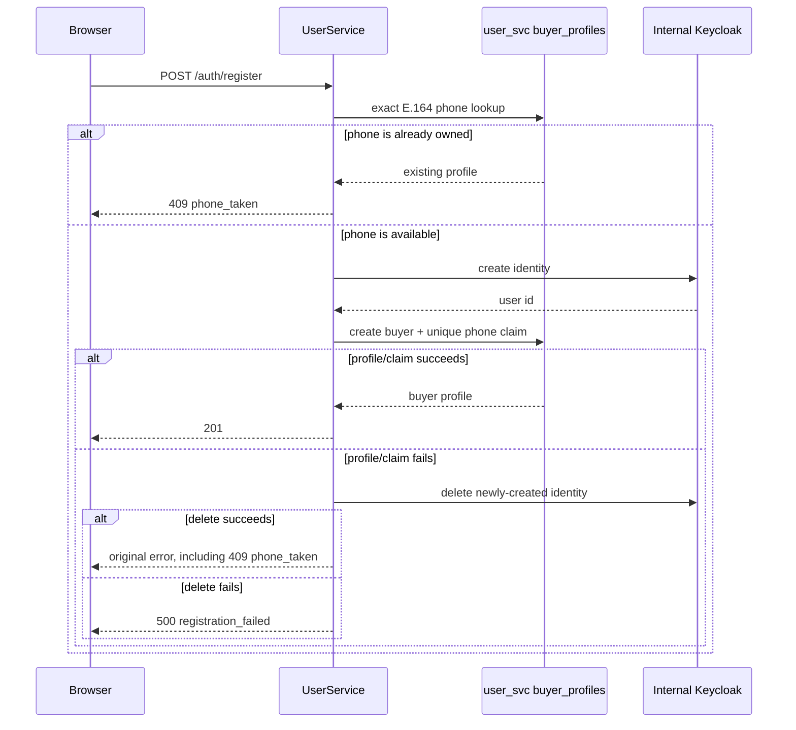

# Registration Identity and Phone Invariants

## Scope

This document fixes the ownership rules for public buyer registration:

- An email identifies exactly one Keycloak account.
- A supplied phone number is an optional, canonical E.164 contact identifier
  claimed by at most one newly created or changed buyer profile.
- A successful registration has both a Keycloak identity and a buyer profile.
  A failed registration has neither.

Seller onboarding, SMS verification, and a self-service legacy-contact
reconciliation workflow are outside this change.

## Current Contract

`POST /auth/register` remains a JSON REST request. Its established response
envelope is additive and unchanged.

| Condition | Status | Error code | Client behaviour |
| --- | --- | --- | --- |
| New email and available phone | `201` | none | Sign in normally |
| Existing Keycloak email | `409` | `email_taken` | Show the email-account message |
| Phone held by another buyer profile | `409` | `phone_taken` | Show the phone field error |
| Invalid phone format | `400` | `validation_error` | Show the format field error |
| Keycloak cleanup failure after profile failure | `500` | `registration_failed` | Do not claim registration succeeded |

### Conflict precedence

The endpoint evaluates a supplied phone before asking Keycloak to create an
identity. This makes the result deterministic when both identifiers already
belong to accounts:

| Existing ownership | First failing boundary | Result | New Keycloak user |
| --- | --- | --- | --- |
| Email only | Keycloak email/username uniqueness | `409 email_taken` | Never created |
| Phone only | User-service phone preflight | `409 phone_taken` | Never created |
| Email and phone | User-service phone preflight | `409 phone_taken` | Never created |
| Neither | Profile persistence after Keycloak creation | `201` | Created and linked to one buyer profile |

Email comparison follows the Keycloak realm's username/email uniqueness rules,
including the case-variant check exercised by the registration E2E. Phone
comparison uses the canonical E.164 value. The preflight is only a readable
fast path; the partial unique index on `phone_claim` remains the final authority
when two requests race.

### Identity ownership

Registration creates one internal Keycloak identity and one user-service buyer
profile. The submitted email is copied into the buyer profile at creation, so
the profile page does not ask the user to edit an internal Keycloak account.
Keycloak remains an internal authentication service and is not a public account
management surface. The only Keycloak read used for email is a legacy recovery
path for profiles created before user-service owned the profile email.

If profile persistence fails after Keycloak succeeds, user-service compensates
by deleting the just-created identity. If that deletion also fails, the API
returns `500 registration_failed` and logs the identity id for operations
reconciliation; it never returns a successful registration response.

The public application never accesses the Keycloak admin console. User-service
uses its internal Keycloak admin client for identity creation, role assignment,
and compensating deletion only.

## Request Flow



## Data Design

The normal read path is an exact lookup:

```sql
SELECT *
FROM user_svc.buyer_profiles
WHERE phone = :canonical_e164_phone;
```

`V12__buyer_phone_claims.sql` adds a nullable `phone_claim` column and a
partial unique index on non-null claims. A newly registered buyer or a buyer
changing their phone receives `phone_claim = phone`; the index makes concurrent
writes race-safe. The application maps that index violation to `phone_taken`.

GDPR anonymization clears both `phone` and `phone_claim`. An anonymized profile
must not remain an owner of a contact identifier: the normal lookup should no
longer find it, and a later registration must be able to claim the released
number. The lifecycle invariant is therefore:

```text
phone IS NULL  <=>  phone_claim IS NULL
```

The migration backfills claims only when a phone has one historical owner. It
does not delete profiles, null phone values, or arbitrarily select an owner for
legacy duplicates. Those records remain visible for operations-led cleanup and
cannot be claimed by a new registration because the exact lookup rejects them.

## Trade-offs and Failure Handling

- A profile lookup before Keycloak creation gives a fast, readable `409`, but
  it cannot eliminate concurrent requests. The database index is the final
  authority for that race.
- Keycloak and PostgreSQL do not share a transaction. The compensating delete
  provides all-or-nothing user-visible behaviour without coupling the services
  into a distributed transaction.
- Retaining ambiguous historical contact data avoids irreversible data loss.
  It leaves a small, explicit legacy exception until account owners are
  reconciled by an authorised operations process.

## Operational Checks

Before converting the legacy compatibility claim to a direct unique `phone`
constraint, operations must resolve every row returned by:

```sql
SELECT phone, count(*) AS profile_count
FROM user_svc.buyer_profiles
WHERE phone IS NOT NULL
GROUP BY phone
HAVING count(*) > 1;
```

Monitor `409` responses by `errorCode`, `registration_failed` responses, and
the count of non-null `phone` values with a null `phone_claim`. The latter is
the legacy reconciliation backlog. Also alert on any anonymized row that still
has a claim:

```sql
SELECT count(*)
FROM user_svc.buyer_profiles
WHERE phone IS NULL
  AND phone_claim IS NOT NULL;
```
