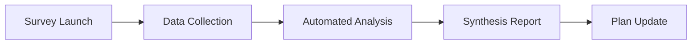

# VNShop Mobile - Automated User Research Pipeline

**Status:** In Progress  
**Auto-updates:** Implementation plan with research findings

---

## Pipeline Overview



---

## Research Materials

### 1. Survey: `survey-vnshop-mobile.json`

```json
{
  "title": "VNShop Mobile Shopping Behavior",
  "version": "1.0",
  "questions": [
    {
      "id": "q1",
      "text": "How often do you shop on your mobile phone?",
      "type": "single",
      "options": ["Daily", "Weekly", "Monthly", "Rarely"]
    },
    {
      "id": "q2",
      "text": "What payment methods do you use most?",
      "type": "multi",
      "options": ["COD (Cash on Delivery)", "MoMo", "VNPay/ZaloPay", "Bank transfer", "Credit card"]
    },
    {
      "id": "q3",
      "text": "What makes you abandon a shopping cart?",
      "type": "multi",
      "options": ["High shipping costs", "Complex checkout", "Slow app", "Lost connection", "Wanted to compare prices", "Changed my mind"]
    },
    {
      "id": "q4",
      "text": "How would you rate your home internet/mobile connection?",
      "type": "single",
      "options": ["Excellent - always works", "Good - occasional issues", "Poor - frequent disconnects", "Very poor - constant issues"]
    },
    {
      "id": "q5",
      "text": "If an app could save your cart when offline, how likely would you use it?",
      "type": "scale",
      "min": 1,
      "max": 5,
      "labels": ["Not useful", "Very useful"]
    },
    {
      "id": "q6",
      "text": "How do you feel about push notifications from shopping apps?",
      "type": "single",
      "options": ["Love them - keep me informed", "Okay if relevant", "Only order updates", "Only promotions", "I disable all"]
    },
    {
      "id": "q7",
      "text": "What features would make you choose this app over others?",
      "type": "open"
    }
  ]
}
```

### 2. Interview Guide: `interview-guide.md`

```markdown
# VNShop Mobile - User Interview Guide
**Duration:** 45-60 minutes  
**Participants:** 5-8 Vietnamese mobile shoppers

## 1. Introduction (5 min)
"Hi, thanks for joining. I'm researching how people shop on their phones for a new app. Your insights will directly shape what we build. Everything you say is anonymous, and you can stop anytime."

## 2. Shopping Context (10 min)

### Q1: Current Behavior
"Tell me about the last time you bought something using your phone."
- Probe: What app/website? Why that one?
- Probe: What went well?

### Q2: Pain Points
"What's the most frustrating part of shopping on your phone?"
- Probe: Connection issues?
- Probe: Payment concerns?
- Probe: Too many steps?

## 3. Cart & Checkout Deep Dive (15 min)

### Q3: Cart Abandonment
"Has it ever happened that you added items to a cart but didn't buy them?"
- Probe: What caused you to stop?
- Probe: Did you come back later?
- Probe: What would have helped?

### Q4: Offline Behavior
"How do you feel when you're shopping and your internet cuts out?"
- Probe: What do you do?
- Probe: Have you lost items in a cart due to this?
- Probe: What would help?

### Q5: Payment Trust
"What makes you feel safe using a payment method?"
- Probe: COD vs online payments?
- Probe: What would make you trust MoMo/VNPay more?

## 4. Notifications (5 min)

### Q6: Notification Tolerance
"Think about shopping apps you have installed. What notifications do you actually read?"
- Probe: Order updates? Promotions? Price drops?
- Probe: What makes you delete an app?

## 5. App Concept Reaction (10 min)

[Show app screenshots/mockups if available]

"What catches your eye first?"
"What would make you want to use this?"
"What would make you delete it right away?"

## 6. Wrap-up (5 min)

"Is there anything about mobile shopping we haven't covered?"
"Any questions for me?"

"Thank you so much. Your feedback is invaluable."
```

### 3. Usability Test: `usability-test.md`

```markdown
# VNShop Mobile - Usability Test Script
**Duration:** 30-45 minutes  
**Tasks:** 4 core tasks with think-aloud protocol

## Setup
- Phone with staging app installed
- Network throttling tool ready (to simulate offline)
- Observer notes template

## Task 1: First-time Experience (5 min)
**Goal:** Evaluate onboarding and auth flow

Script:
1. "Please sign up and log in to this app"
2. "Try to find and view a product"

Success: Completes without verbal help
Failure: Stuck on any step > 30 seconds

## Task 2: Add to Cart (3 min)
**Goal:** Evaluate product discovery and cart interaction

Script:
1. "Add any product to your cart"
2. "Change the quantity"
3. "Remove it"

Success: All actions completed
Failure: Can't find cart, UI confusion

## Task 3: Checkout Flow (10 min)
**Goal:** Validate payment selection and address entry

Script:
1. "Complete a purchase"
2. [Observer note: which payment method chosen and why]
3. "What did you think of that process?"

Success: Completes mock purchase
Failure: Drops off at any step

## Task 4: Offline Resilience (5 min)
**Goal:** Evaluate error handling and offline cart

Script:
1. "Keep shopping... I'll turn off your internet now"
2. [Throttle network to offline]
3. "What do you see? What would you expect to happen?"
4. [Restore network]
5. "Is your cart still there?"

Success: User understands offline state, cart preserved
Failure: Confusing error, cart lost

## Debrief Questions
1. "What was easiest?"
2. "What was hardest?"
3. "What would you change?"
4. "Would you use this app over [competitor]?"

## Observation Checklist
- [ ] Facial expressions of confusion/frustration
- [ ] Verbal hesitation before actions
- [ ] Recovery from errors
- [ ]手指操作 (finger操作) ease
- [ ] Loading time reactions
```

---

## Automated Synthesis

### Synthesis Categories

| Theme | Key Questions | Insights To Extract |
|-------|---------------|---------------------|
| Cart & Offline | Q4, T4 | Offline behavior patterns, feature value |
| Payments | Q2, Q5 | Payment method priority, trust factors |
| Notifications | Q6 | Tolerance levels, valued types |
| UX Friction | T1-T3, Q3 | Checkout pain points, drop-off reasons |
| Differentiation | Q7, R5 | Winning features vs competitors |

### Output Template: `research-findings-template.md`

```markdown
# VNShop Mobile - Research Findings
**Date:** [COMPLETED DATE]
**Participants:** [N interviews, M survey responses]

---

## Executive Summary

[3-5 bullet points with key insights]

---

## Key Finding 1: [Title]

**What we heard:**
> "[Quote from participant]"

**Data:**
- [X]% of survey respondents...
- [Observation from usability test]

**Impact on implementation:**
- [Recommendation for Phase X]

---

## Key Finding 2: [Title]

[Same structure]

---

## Feature Prioritization

| Feature | Research Support | Implementation Priority |
|---------|------------------|------------------------|
| Offline cart | [X] quotes, [Y]% survey | P1 |
| [Feature] | ... | P2 |

---

## Recommendations

1. **[HIGH]**: [Recommendation]
2. **[MEDIUM]**: [Recommendation]
3. **[LOW]**: [Recommendation]

---

## Appendix: Raw Data

### Interview Notes
[Attached separately]

### Survey Results
[Charts and tables]
```

---

## Research → Plan Update Workflow

### Trigger: Research Complete

1. **Collect data:**
   - Interview transcripts
   - Usability test recordings/notes
   - Survey responses

2. **Run synthesis:**
   - Extract themes using affinity mapping
   - Quantify survey responses
   - Identify top 5 insights

3. **Update implementation plan:**
   - Add research findings section
   - Re-prioritize features based on findings
   - Add/modify tasks based on new insights

---

## Automation Status

| Component | Status | Notes |
|-----------|--------|-------|
| Survey template | ✅ Ready | JSON format for Typeform/Google Forms |
| Interview guide | ✅ Ready | Structured for 45-60 min session |
| Usability test | ✅ Ready | 4 tasks with observer checklist |
| Synthesis template | ✅ Ready | Theme-based with recommendations |
| Data collection | ⏳ Manual | Requires participant recruitment |
| Automated analysis | ⏳ Partial | Templates ready, actual synthesis manual |
| Plan update | ⏳ Pending | Runs after research completion |

---

## Next Steps

- [ ] Deploy survey (Typeform/Google Forms)
- [ ] Schedule interviews (5-8 participants)
- [ ] Install staging app for usability tests
- [ ] Conduct research
- [ ] **Automated:** Synthesize findings
- [ ] **Automated:** Update implementation plan
- [ ] Deliver findings to you

---

*This pipeline updates: `docs/superpowers/plans/2026-07-08-vnshop-flutter-mobile-implementation.md`*
